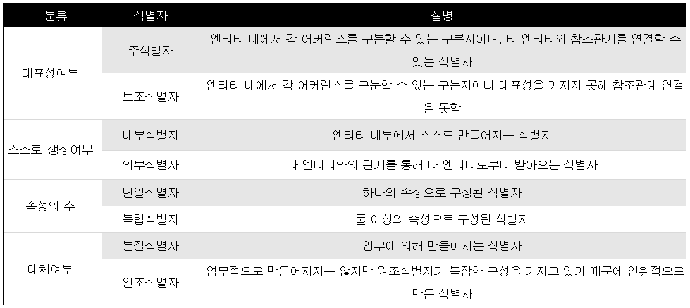

## 데이터 모델링

### __기본 논리적 데이터 모델링__

 기본 논리적 데이터 모델링 단계에서는 주요 엔터티 들을 기준적으로 정의하고, 그들 간의 릴레이션(관계)을 담아낸 개념적 논리 모델 ERD를 작성한다. 생성한 엔티티를 대상으로 속성 후보를 선정하여 검증 과정을 거치게 되면 속성이 결정되고 경우에 다라 보다 상세한 엔터티가 추가 된다.

이어서 완료된 주요 엔터티들에 대한 식별자를 확정하며, 데이터 모델의 골격이 되는 이것들은 매우 견고하게 정의 되어야 하므로 상세한 사례 데이터를 작성해 가며 데이터 모델을 검증하면 기본 논리적 데이터 모델링이 완성된다.
  
- 기본 논리적 데이터 모델링의 세부 단계  
1. __엔터티 정의__
 
   1. __엔터티 후보 선정__
    
    엔터티는 하나씩 확정해 갈 수 있는것이 아니라 먼저 여러 엔터티 후보들을 다양한 경로를 통해 선정하여 최종 엔터티들을 결정해 가는 구체적인 절차를 거쳐 종합적이고 전략적으로 엔터티를 확정한다.  
    
   2. __엔터티 형태별 분류__
  
     후보로 선정된 모든 엔터티들을 대상으로 모델링을 시작해 본다면 엄청난 복잡성에 빠지며 오류의 확률도 증가하게 된다.  
     이를 방지하기 위해서 핵심 엔터티들을 따로 분류해 내고 이들의 의미를 분명하게 정의하기 위하여 주제 영역 별로 엔터티를 분류하는 과정이다.
    
   3. __엔터티 검증 및 확정__  
   
     이 과정 부터는 핵심 엔터티에 대해서만 정의해 간다. 

1. __릴레이션 정의__

   1. __릴레이션 존재 파악__

    이 단계의 보다 용이한 접근을 위해 관계 상관도(relationship martrix)를 이용하여 제 3자의 입장에서 관계의 존재 유무만 파악한다.
    
   2. __관계명칭 확정__
   
    관계가 존재한다는 점이 파악 된다면 구체적으로 어떤 내용의 관계를 의미하는지 결정한다.  
    즉, 릴레이션의 내용을 명확하게 정의하는 과정이다.  
    릴레이션의 정의 또한 엔터티에서 처럼 하나로 묶을 수도 있고 구체적으로 세분화 시킬 수도 있으며, 이 단계의 결과는 관계 상관도의 최종 모습으로 나타나게 된다.
    
1. __개념 ERD 작성__

   1. __핵심 엔터티 배치__
   
    관계 상관도를 완성한후 내용을 분석하여 가로, 세로의 빈 칸에 내용이 많이 채워진 엔터티를 선별한다.  
    내용이 많이 채워졌다는 것은 다른 엔터티들과 많은 관계를 맺고 있는 주요 엔터티들로 ERD를 작성하는데에 있어 적절한 위치를 잡아 배치한다.
   
   2. __키 엔터티 연결__
   
    앞단계에서 선택된 엔터티들은 메인(main)엔터티 들로, 이들의 부모가 되는 키(key) 엔터티들을 적당한 위치에 놓고 릴레이션을 맺어 나가야 한다.
    
   3. __릴레이션 확정__
   
    이 단계에서는 릴레이션의 구체적인 모습을 결정하게 된다. 관계의 확정은 반드시 물증 조사에 의한 구체적인 판단에 의해서 실시되어야 하며, 릴레이션이란 어느 한 쪽이 주어가 되어서 상대를 바라보는 관계와 그 반대 쪽이 주어가 되어서 다시 이쪽의 상대를 바라보는 두가지 관계의 합성으로 생성된다.
    
    이 과정에서 많은 예외 사항이 검토 되어야 하며, 많은 새로운 업무규칙 들이 정의 되어가고, 앞서 결정해 두었던 엔터티의 정의 또한 더욱 구체적으로 규정되어 진다.
    
    * 지금까지 작업한 결과로서 __`개념적 논리 데이터 모델`__(Conceptual Logical Data Model)을 얻게 되며, 이 데이터 모델은 구체적이지는 않지만 시스템의 구조를 한 눈에 볼수 있는 귀중한 자료라 할수이다.  
     이 데이터 모델에 가능한 최대한의 속성 후보들을 선정한 후 다음과 같은 4가지 단계를 통해 속성을 확정하거나 추가적인 엔터티를 도출하게 된다.
  
1. __속성정의__
    
    1. __1단계 - 원자 단위__

     속성을 결정하는 첫번째 검증 내용은 "원자 단위 인가?" 라고 질문하는 것이다.  
     __`원자 단위`__ 란 더이상 분리될 수 없는 최소한의 단윌를 뜻한다.  
     즉, 소속된 엔터티와 그 속성의 구체적인 의미에 따라 달라지므로 명확한 판단의 기준을 가지고 결정하는것이 필요하다.
     
    2. __2단계 - Single Value__(하나의 값)  
    
     속성이 반드시 하나의 값만 가지는 지를 결정해야 한다. 이 단계는 __정규화 작업의 제 1정규형(1st NF)__ 와 동일한 것으로 정상적인 모델링이라면 제 1정규형은 속성 정의 단계에서 이루어 져야 함을 의미한다.  
     주의할 점은 비록 현재는 하나의 값만을 가지지만 앞으로는 보다 상세한 관리를 할 필요가 없는지 따져 보아야 한다는 것이다.  
     이 과정을 통해 모델링은 새로운 개선점을 찾아 내는 과정이 포함 되어 지는 것이다.  
     
    3. __3단계 - 가공 값 제거__  
    
     만약, 속성 후보 중 엔터티의 다른 속성들로 재현할 수 있다거나, 다른 엔터티의 정보를 이용하여 재현할 수 있다면, 그 속성은 이미 원본이라 할수 없다. 따라서 이러한 가공 값들을 논리적 데이터 모델링에서 제거해 주어야 한다.  
     __데이터 모델링의 1차 목표는 자신의 본질을 정확히 정의하자__ 는데 있으므로 가공 값들은 제거되어야 하는 것이다.    
     물론 가공 값을 판정하는 것이 쉬운일은 아니지만 물리적 모델링 단계에서 다시 검토 되어 질것이다.  
     
     4. __4단계 - 상세화 관리 결정__ (상세 관리 여부 판정)
     
     1~3단계의 판단이 완료 되었더라도 보다 상세한 수준의 데이터를 관리해야 할 것인지를 결정하는 단계이다.  
     이 단계를 중히 거치지 않으면 설계 보완이 발생하는데 주된 원인이 된다.
     
1. __식별자 지정__

     

     1. __의미상 주어 확정__  
     
     모델링 과정에서는 __식별자__ 를 __의미상의 주어__ 를 가지고 표현한다.  
     의미상의 주어는 __인조(artificial) 식별자가 아닌__ 원래 있던 속성이나, 부모 엔터티로 부터 상속받은 릴레이션으로 표현한 자신의 __탄생 원인__ 이 되는 속성이나 관계를 뜻한다.  
     물론 최종 식별자는 다음 단계에서 결정되어지지만, 이 단계까지는 앞으로 불려질 자신의 최종 식별자보다는 자신이 누구인지?, 어떠한 과정에서 생성된 집합인가?라는 점이 중요하다는 점이다.  
     
     모델링은 앞서 __자신의 본질을 정확히 정의__ 하는 데 가장 중요한 목적이 있다.
     
     2. __상속 및 단절 전략__
     
     식별자는 단지 개체 식별만을 목적으로 하는 것이 아니다. 어떠한 집합에 어떤 상속을 받고 있는지를 나타내는 정보가 된다.  
     
     즉, 상속과 적절한 단절은 정보의 연속성과 단순성의 중요한 효과를 제공하며, 이러한 특성을 이용하여 적절한 전략을 수립하면 복잡하더라도 엑서스 깊이는 단순하도록 설계가 가능하다.  
     
     3. __식별자 확정__
     
     상속 및 단절 전략에 따르면 상황에 다라 적절한 인조 식별자를 부여하게 된다. 식별자의 소유는 자기 엔터티이지만 연결은 주로 다른 엔터티가 하게 되므로 자신을 참조하는 주면의 여러 엔터티와 종합적인 상황 판단을 하여 결정하여야 한다.
     
1. __데이터 모델 검증__

     1. __사례 데이터 작성__
      
     2. __데이터 모델 확정__ 
     
      사례 데이터 작성을 통해 작성된 모델을 시뮬레이션을 진행
      
     3. __주요 속성값 정의__
     
      속성에 정의할 값들의 형태를 결정하고, 그 값들이 데이터 생성시에 반드시 입력되어야 하는 지에 대한 결정도 같이 정의한다.
     
     
     - 참조  
     DATABASE.SARANG.NET - 정재익 - "데이터 모델링 강좌"    
     http://database.sarang.net/?inc=read&aid=433&criteria=dbms&subcrit=&id=&limit=20&keyword=&page=3
     
     
     
     
     
     
     
    
