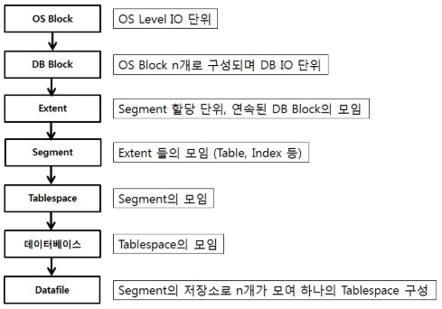
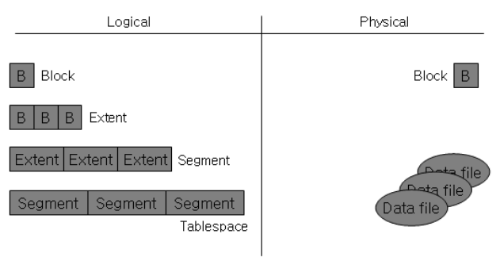
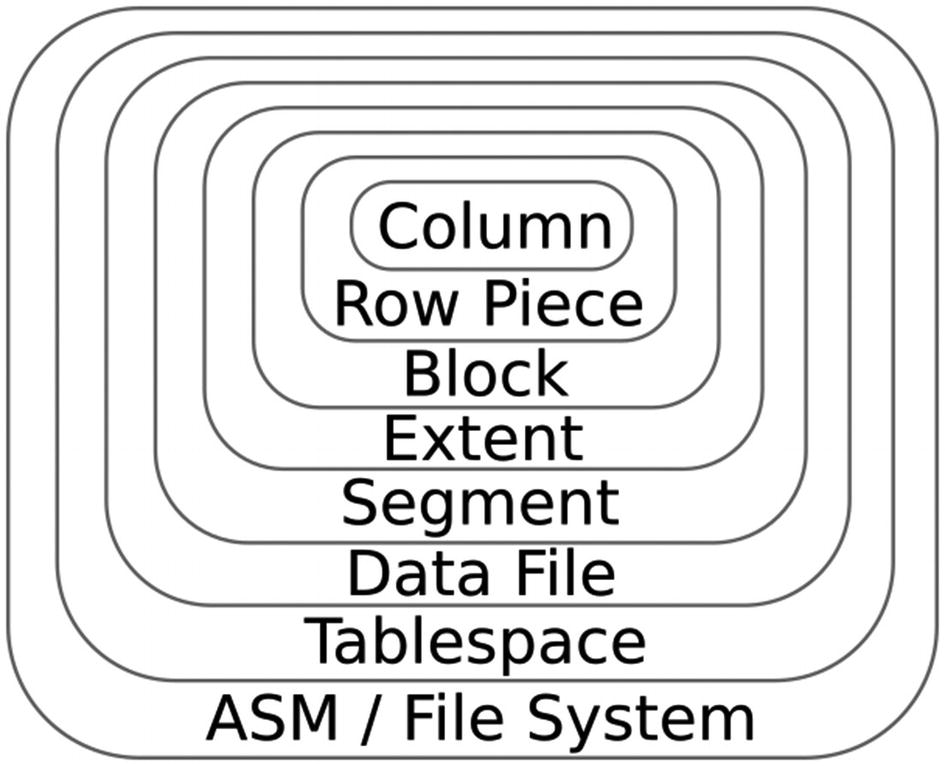
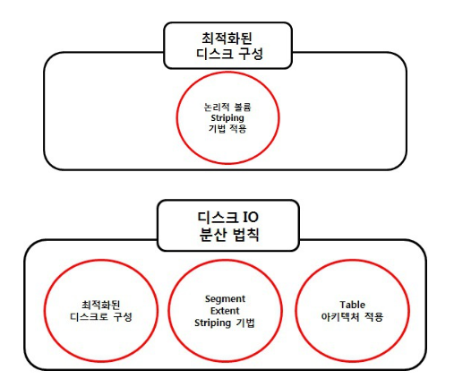

# Disk IO (Input / Output)

   ## DiskIO 란
    
   * 데이터를 작성하고 변경할시 디스크에 저장되는 것
      
* 오라클 스토리지의 구조 7단계  
  

* Block & Extent & Segment  
  

* Oracle Database Architecture  
  

    - __ Block __  
    DB Block(Oracle Block)은 OS Block을 한개이상 합쳐서 생성하며 DB_BLOCK_SIZE로 지정 가능하다.
    DB Block의 크기가 4KB이고 OS Block이 2KB 이면 OS Block 2개가 합쳐져야 1개의 DB Block이 생성된다.  
    SGA(ORACLE SERVER의 메모리 영역 - ORACLE의 인스턴스에 대한 데이터와 제어정보를 가지는 공유 메모리 영역의 집합)의 DB 블록 버퍼에서 I/O의 기본 단위 이다.
    Block의 단위는 init.ora 파일에서 DB_BLOCK_SIZE로 지정한다.
        
    - __ EXTENT __  
    연속적인 Block을 여러개 묶어 놓은 단위를 뜻하며 I/O를 진행할 때 속도를 높이기 위해 도입 된 개념이다.
       
    - __ SEGMENT __
    TableSpace 내에 특정 구조에 대한 모든 데이터를 갖고 있는 하나 혹은 하나 이상의 EXTENT 집합을 말한다.  
    (Data Segment / Index Segment / Rollback Segment / Temporary Segment)

    ## DiskIO 의 분산 (저장 방식)
    
  

- Segment Extent Striping 구성  
    1. 디스크 분산 : 각 Datafile은 서로 다른 VG에 생성  
    2. Segment Extent Striping : Test Table의 Extent는 각 Datafile에 Round Robin 방식으로 Extent 할당
    3. Segment Extent String 과 디스크 구성 결합 : Segment Extent Striping과 디스크 구성에 의해 Physical 디스크에 분산되며 Test Table 의 데이터는 각 디스크에 저장됨 이에 따라 디스크를 Access 할 호가률 증가
        
- Segment Extent Striping 장점  
    * 한 번 Access 시 모든 디스크 Access 확률 증대
    * 해당 Table에 대해서 모든 디스크로 균등하게 데이터를 저장함으로써 디스크 IO 분산 가능
        
        

##참조

* 디스크IO  
https://boxtalk.tistory.com/14
* Block & Extent & Segment 이미지 참조  
https://okun.tistory.com/entry/Block-Extent-Segment
* Oracle Database Architecture 이미지 참조  
https://link.springer.com/chapter/10.1007/978-1-4842-4517-0_10

[Round Robin]
: 시분할 시스템을 위해 설계된 선점형 스케줄링의 하나로 프로세스 사이에 우선순위를 두지 않고, 순서대로 시간단위로 CPU를 할당하는 방식의 CPU 스케줄링 알고리즘
프로세스들 사이에 우선순위를 두지 않고, 순서대로 시간단위 CPU를 할당하는 방식, 보통 시간 단위는 10ms ~ 100ms 정도이고 시간단위 동안 수행한 프로세스는 준비 큐의 끝으로 밀려나게 된다. 문맥 전환의 오버헤드가 큰반면, 응답시간이 짧아지는 장접이 있어 실시간 시스텡메 유리하고, 할당되는 시간이 클 경우 비선점 FIFO 기법과 아진다.
