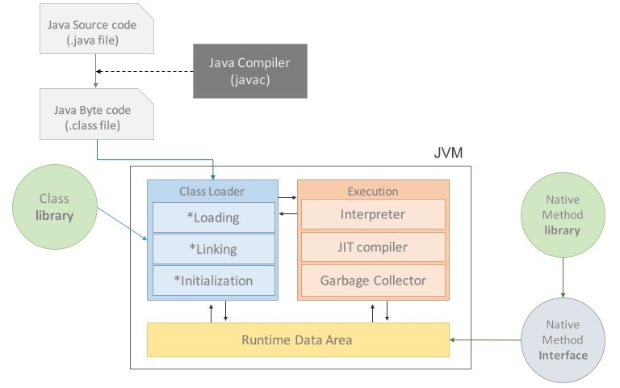
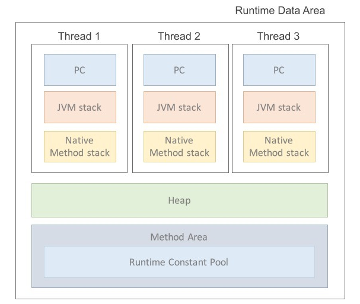

# JAVA

## JAVA의 동작 과정

  Hello.java -> javac.exe(자바 컴파일러) -> Hello.class 생성 -> java.exe(자바 인터프리터) -> "Hello World" 출력  
  
  ### 컴파일러란?  
  
   원시언어에서 목적 언어로 바꾸는 작업으로 A라는 언어에서 B라는 언어로 통역해 주는 작업이다. 프로그래밍에서는 주로 고급 언어를 기계어로 바꿔주는 것을 말한다.  
   C 나 C++ 의 경우 컴파일러는 CPU나 운영체제마다 가지고 있는 기계어가 조금씩 다르기 때문에 CPU나 운영체제마다 별도의 컴파일러가 필요하다. 같은 고급언어로 작성한 코드라도 다른 기계어 코드를 생성해야 하는 것이다.
    
   하지만 자바의 경우에는 컴파일러가 기계어로 바꾸는 것이 아니라 '바이트 코드'로 변환 시킨다.
    
## 자바의 가장 큰 장점은 JVM이다.

  자바로 코드를 작성하면 자바 컴파일러가 *.class(바이트 코드) 파일을 만들어주고 JVM에서 운영체제(Window, Linux)에 맞는 형태로 변환해 주기 때문에 자바로 자겅된 코드는 운영체제에 독립적이다. 하지만 JVM은 운영체제에 종속적이기 때문에 해당하는 OS에 맞는 JVM 설정을 해줘야 한다.
  
  ### JVM 이란?
  
   JAVA Virtual Machine, 자바 가상 머신의 약자를 따서 줄여 부르는 용어로(가상머신이란 프로그램의 실행을 위해 물리적 머신과 유사한머신을 소프트 웨어로 구현한 것이다.) JVM 역할을 자바 어플리케이션을 클래스 로더를 통해 읽어 들여 자바 API와 함께 실행하는 것이다. 그리고 JVM은 JAVA와 OS 사이에 중개자 역할을 수행하여 JAVA가 OS에 구애받지 않고 재사용을 간으하게 해준다. 그리고 가장 중요한 메모리관리, Garbage collection을 수행한다. JVM은 스택기반의 가상머신 으로 ARM 아키텍쳐 같은 하드웨어는 레지스터 기반으로 동작하는데 비해 JVM은 스택기반으로 동작한다.
  
  ### 자바프로그램 실행 과정
  
  1. 프로그램이 실해오디면 JVM은 OS로 부터 이 프로그램이 필요로 하는 메모리를 할당 받는다. JVM은 이 메모리를 용도에 따라 여러 영역으로 나누어 관리한다.  
  2. 자바 컴파일러(javac)가 자바 소스코드(.java)를 읽어들여 자바 바이트 코드(.class)로 변환시킨다.  
  3. Class Loader를 통해 class파일들을 JVM으로 로딩한다.  
  4. 로딩된 class파일들은 Execution engine을 통해 해석된다.  
  5. 해석된 바이트 코드는 Runtime Data Areas에 배치되어 실질적인 수행이 이루어지게 된다.  
  이러한 실행 과정 속에서 JVM은 필요에 따라 Thread Synchronization과 Garbage Collection 같은 관리작업을 수행한다.
  

  
  ### JVM의 구성요소
  
  1. 자바 인터프리터 (JAVA Interpreter)
  2. 클래스 로더
  3. JIT 컴파일러 (Just In Time Compiler)
  4. 가비지 컬렉터
  5. Execution Engine(실행 엔진)
  
  #### 인터프리터와 클래스 로더
  
   자바 컴파일러에 의해 변환된 자바 바이트 코드를 읽고 해석하는 것이 자바 인터프리터이다. 자바는 동적으로 클래스를 읽어오므로, 프로그램이 실행중인 런타임에서야 모든 코드가 자바 가상머신과 연결된다. 이렇게 동적으로 클래스를 로딩해 주는 것이 클래스 로더 이다.  
   JVM 내로 클래스(.class파일)를 로드하고, 링크를 통해 배치하는 작업을 수행하는 모듈로 Runtime 시에 동적으로 클래스를 로드한다. jar파일 내 저장된 클래스 들을 JVM위에 탑재하고 사용하지 않는 클래스들은 메모리에서 삭제한다. (컴파일러 역할) 자바는 동적코드, 컴파일 타임이 아니라 런타임에 참조한다. 즉, 클래스를 처음으로 참조할 때, 해당 클래스를 로드하고 링크한다는 것이다. 그 역할을 클래스 로더가 수행한다.
  
  #### Execution
    
   클래스를 시행시키는 역할로 클래스 로더가 JVM내의 런타임 데이터 영역에 바이트 코드를 배치시키고, 이건은 실행엔진에 의해 실행된다. 자바 바이트코드는 기계가 바로 수행할 수 있는 언어보다는 비교적 인간이 보기 편한 형태로 기술된 것이다. 그래서 실행 엔진은 이와 같은 바이트코드를 실제로 JVM내부에서 기계가 실행할 수 있는 형태로 변경한다.
   
  #### JIT(Just In Time) Compiler
  
   Interpreter 방식의 단점을 보완하기 위해 도입된 방식으로, Interpreter 방식으로 실행하다가 적절한 시점에 바이트 코드 전체를 컴파일 하여 네이티브 코드로 변경하고, 더 이상 Interpreting 하지 않고 네이티브 코드로 직접 실행하는 방식이다.  
   네이티브 코드는 캐시에 보관되기 때문에 한 번 컴파일 된 코드는 빠르게 실행할 수 있다. 물론 한 번만 실행되는 코드라면 JIT보다 Interpreter 방식이 유리하다. 따라서 JVM은 해당 메소드가 얼마나 자주 수행되는지 체크하고, 일정 정도를 넘을 때 컴파일을 수행한다.
    
  #### 가비지 컬렉터
  
   가비지 컬렉터는 사용하지 않는 메모리를 자동으로 회수해주는모듈(쓰레드)가 있다. 메모리 관리를 알아서 해주니 개발자는 편하게 프로그래밍을 할 수 있게 도와준다.
  
  #### 컴파일러 VS 인터프리터
   
   - __컴파일러__ - 고급언어로 쓰여진 프로그램이 컴퓨터가 이해할 수 있는 기계어로 바꿔준다. 번역과 실행 과정을 거쳐야 하기 때문에 변역 과정이 번거롭고 시간이 오래 걸리지만, 한번 번역한 언어는 이후 다시 번역하지 않으므로 실행 속도가 빠르다.
     
   - __인터프리터__ - 한 단계씩 기계어로 해석하여 실행하는 언어처리 프로그램으로 줄 단위로 번역, 실행되기 때문에 시분할 시스템에 유용하며 원시 프로그램의 변화에 대한 반응이 빠르다. 단 한 단계씩 테스트와 수정을 하면서 진행시켜 나가기 때문에 대화형 언어에 적합하지만 실행 시간이 길어 속도가 늦다는 단점이 있고 목적 프로그램이 생성되지 않는다.
     
### Runtime Data Area

프로그램을 수행하기 위해 OS에서 할당받은 메모리 공간

1. PC Register
  Thread 가 시작될 때 생성되며 생성될 때마다 생성되는 공간으로 쓰레드 마다 하나씩 존재하나다. Thread가 어떤 부분을 어떤 명령으로 실행해야 할 지에 대한 기록을 하는 부분으로 수행 중인 JVM 명령의 주소를 갖는다.

### 자바 사용시 유의할 점

  자바에서 모든 코드는 반드시 클래스 안에 존재해야 하며, 서로 관련된 코드들을 그룹으로 나누어 별도의 클래스를 구성하게 되고 그 클래스들이 모여 하나의 Java 어플리케이션을 이루게 된다. 클래스를 작성하는 방법은 간단한데 키워드 'class' 다음에 클래스의 이름을 적고, 클래스의 시작과 끝을 의미하는 괄호 {} 안에 원하는 코드를 넣으면 된다.
  
  public static void main(String[] args) 는 main 메소드의 선언부로, 프로그램을 실행할 때 java.exe에 의해 호출된다. 모든 클래스가 main 메소드를 가지고 있어야 할 필요는 없지만 하나의 java 어플리케이션 안에 하나는 반드시 필요하다.
  
  하나의 소스파일에 하나의 클래스만을 정의하는 것이 보통이지만, 하나의 소스파일에 둘 이상의 클래스를 정의하는 것도 가능하다. 이 때 주의해야 할 점은 '소스파일의 이름은 public class의 이름과 일치해야 한다.' 는 것이다. 만일 소스파일 내에 public class가 없다면, 소스파일의 이름은 소스파일 내의 어떤 클래스의 이름으로 해도 상관 없다.
