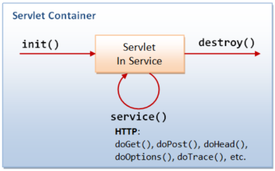
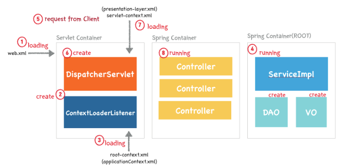

# Servlet

  ## Servlet 이란?
  
  웹 프로그래밍에서 클라이언트의 요청을 처리하고 그 결과를 다시 클라이언트에게 전송하는 Servlet 클래스의 구현 규칙을 지킨 자바 프로그래밍 기술
  
  - 클라이언트의 요청에 대해 동적으로 작동하는 웹 어플리케이션 컴포넌트
  - html을 사용하여 요청에 응답한다.
  - Java Thread를 이용하여 동작한다.
  - MVC패턴에서 Controller 로 이용된다.
  - HTTP 프로토콜 서비스를 지원하는 javax.servlet.http.HttpServlet 클래스를 상속받는다. UDP보다 속도가 느리다.
  - HTML 변경 시 Servlet 을 재컴파일 해야 하는 단점이 있다.
  
  ## Servlet의 동작 방식
  
  

  1. 클라이언트가 URL을 클리갛면 HTTP Request를 Servlet Container 로 전송
  
  1. HTTP Request를 전송받은 Servlet Container는 HttpServletRequestResponse 두 객체를 생성
  
  1. web.xml은 사용자가 요청한 URL을 분석하여 어느 서블릿에 대한 요청인지 찾음
  
  1. 해당 서블리세서 service메소드를 호출한 후 클라이언트의 POST, GET 여부에 따라 doGet() 또는 doPost()를 호출
  
  1. doGet() or doPost() 메소드는 동적 페이지르르 생성한 후 HttpServletResponse객체에 응답을 보냄
  
  1. 응답이 끝나면 HttpServletRequest, HttpServletResponse 두 객체를 소멸
  
  ## Servlet 생명주기

  1. init() - 서버가 켜질때 한번만 실행
    클라이언트의 요청이 들어오면 컨테이너는 해당 서블릿이 메모리에 있는지 확인하고 없을경우 init()메소드를 호출하여 적재한다. init()메소드는 처음 한번만 실행되기 때문에, 서블릿의 쓰레드에서 공통정으로 사용해야 하는 것이 있다면 오버라이딩하여 구현됩니다. 실행중 서블릿이 변경될 경우, 기존 서블릿 객체를 소멸시키고, init()을 통해 새로운 내용을 다시 메모리에 적재 시킨다.
    
  1. service() - 모든 유저들의 요청을 받음
    클라이언트의 요청에 따라서 service()메소드를 통해 요청에 대한 응답이 doGet(), doPost()로 분기된다. 이때 서블릿 컨테이너가 클라이언트의 요청이 오면 가장 먼저 처리하는 과정으로 생성된 HttpServletRequest, HttpServletResponse 에 의해 request와 response객체가 제공된다.
    
  1. destroy() - 서버가 꺼질때 한번만 실행
    컨테이너가 서블릿에 종료 요청시 destroy()메소드가 호출되는데 마찬가지로 한번만 실행되며, 종료시에 처리해야 하는 작업들은 destroy()메소드를 오버라이딩하며 구현된다.
    
  ## Servlet Container ( 서블릿 컨테이터 )

  - Servlet 을 관리해주는 컨테이너
  
    서블릿이 어떤한 역할을 수행하는 정의서라고 한다면, 서블릿 컨테이너는 그 정의서를 보고 수행한다고 불 수 있다. 서블릿 컨테이너는 클라이언트 요청(Request)을 받아주고 응답(Response) 할 수 있게, 웹서버와 소켓을 만들어 통신하며 대표적인 예로 톰캣(Tomcat)이 있다. 톰캣은 실제로 웹서버와 통신하여 JSP(자바 서버 페이지) 와 Servlet이 작동하는 환경을 제공해 준다.
  
  ## Serlvet Container 의 역할
  
  1. 웹서버와의 통신 지원
    서블릿 컨테이너는 서블릿과 웹서버가 손쉽게 통신할 수 있게 해준다. 일반적으로 우리는 소켓을 만들고, listen, accept 등을 해야하지만 서블릿 컨테이너는 이러한 기능을 API로 제공하여 복잡한 과정을 생략하수 있게 지원해 준다. 따라서 개발자가 서블릿에 구현해야 할 로직에 대해서만 초점을 두게끔 도와준다.
  
  1. 서블릿 생명주기( Life Cycle ) 관리
    서블릿 컨테이너는 Servlet Class 를 로딩하여 인스턴스화 하고, 초기화 메소드를 호출하며, 요청이 들어오면 적절한 서블릿 메소드를 호출 함으로써 Servlet의 탄생과 죽음을 관리한다.
    또한 Servlet 이 생명을 다 한 순간에는 적절하게 Garbage Collection(가비지 컬렉션)을 진행하여 편의를 제공합니다.
    
  1. Multi - Thread 지원 및 관리
    서블릿 컨테이너는 요청이 올 때 마다 Thread Pool를 통해 다중 Thread를 생성 및 운영해 줌으로써 따로 관리해줄 필요가 없다.
    
  1. 선언적인 보안 관리
    서블릿 컨테이너 사용시 일반적인 보안 관리는 XML 배포 서술자에 기록하므로써 보안에 대해 수정할 일이 생겨도 자바 소스코드를 수저어하여 다시 컴파일 하지 않아도 보안관리가 가능하다.
    
   ## 웹 어플리케이션 동작 원리 - Spring Framework
    

    
  1. 웹 어플리케이션이 실행되면 Tomcat(WAS)에 의해 web.xml이 loading 된다.
  
  1. web.xml에 등록되어 있는 ContextLoaderListener( Java Class )가 생성된다. 
     ContextLoaderListener 클래스는 ServletContextListener 인터페이스를 구현하고 있으며, Applicationcontext를 생성하는 역할을 수행한다.
         
  1. 생성된 ContextLoaderListener는 root-context.xml을 loading 한다.
  
  1. root-context.xml에 등록되어 있는 Spring Container가 구동된다. 이 때 개발자가 작성한 비즈니스 로직에 대한 부분과 DAO, VO 객체들이 생성된다.
  
  1. 클라이언트로 부터 웹 애플리케이션 요청이 온다.
  
  1. DispatcherSerlet(Servlet)dl todtjdehlsek. DispatcherServler 은 FrontController의 역할을 수행한다. 클라이언트로부터 요청 온 메시지를 분석하여 알맞은 PageController에게 전달하고 응답을 받아 요청에 따른 응답을 어떻게 할 지 결정만 한다. 실질적인 작업은 Pagecontroller에서 이루어지기 때문이다. 이러한 클래스들을 HandlerMapping, ViewResolver 클래스라고 한다.
  
  1. DispatcherServlet은 servlet-context.xml 을 loading 한다.
  
  1. 두번재 Spring Container가 구동되며 응답에 맞는 PageController 들이 동작한다. 이 때 첫번째 Sring Container 가 구동되면서 생성된 DAO, VO, ServiceImpl 클래스들과 협업하여 알맞은 작업을 처리하게 된다.

