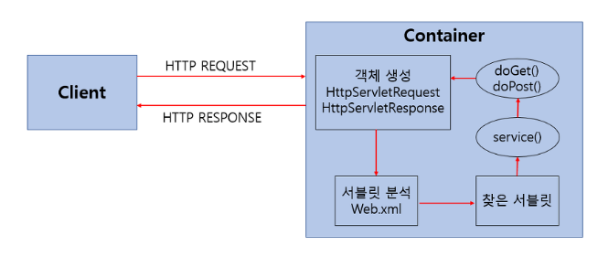

# Servlet

  ## Servlet 이란?
  
  웹 프로그래밍에서 클라이언트의 요청을 처리하고 그 결과를 다시 클라이언트에게 전송하는 Servlet 클래스의 구현 규칙을 지킨 자바 프로그래밍 기술
  
  - 클라이언트의 요청에 대해 동적으로 작동하는 웹 어플리케이션 컴포넌트
  - html을 사용하여 요청에 응답한다.
  - Java Thread를 이용하여 동작한다.
  - MVC패턴에서 Controller 로 이용된다.
  - HTTP 프로토콜 서비스를 지원하는 javax.servlet.http.HttpServlet 클래스를 상속받는다. UDP보다 속도가 느리다.
  - HTML 변경 시 Servlet 을 재컴파일 해야 하는 단점이 있다.
  
  ## Servlet의 동작 방식
  
  
