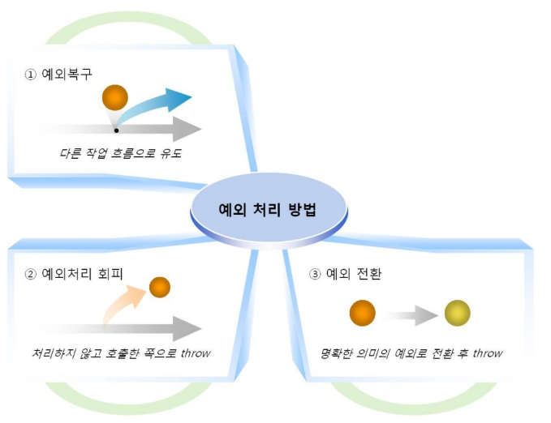

# 예외란? - Error VS Exception

  - 오류( Error ) 와 예외( Exception ) 의 구분
  
  __오류(Error)__ 는 시스템에 비정상적인 상황이 생겼을 때 발생한다. 이는 시스템 레벨에서 발생하기 때문에 심각한 수준의 오류이다. 따라서 개발자가 미리 예측하여 처리할수 없기 때문에, 어플리케이션에서 오류에 대한 처리를 신경 쓰지 않아도 된다.

  **예외(Exception)** 는 개발자가 구현한 로직에서 발생한다. 즉, 예외는 발생할 상황을 개발자가 미리 예측하여 처리할 수 잇는 것으로 예외를 구분하고 그에 따른 처리 방법을 명확히 알고 적용하는 것이 중요하다.
  
## 예외 클래스


  위 그림은 예외클래스의 구조로, 모든 예외 클래스는 Throwable 클래스를 상속 받고 있으며, Throwable은 최상위 클래스 Object의 자식 클래스 이다.
  
  Throwable을 상속받는 클래스는 Error와 Exception이 있다. Error는 시스템 레벨의 심각한 수준의 에러이기 때문에 시스템에 변화를 주어 문제를 처리해야 하는 경우가 일반적이다. 반면에 Exception은 개발자가 로직을 추가하여 처리할 수 있다.
  
  Exception은 수많은 자식클래스를 가지고 있다. 그 중 RuntimeException을 주목해야 한다. RuntimeException은 **CheckedException** 과 **UncheckedException** 을 구분하는 기준이다. Exception의 자식 클래스 중 RuntimeException을 제외한 모든 클래스는 checkedEception이며, RuntimeException과 그의 자식 클래스 들을 UncheckedException이라 부른다.
  
## Checked Exception과 Unchecked(Runtime) Exception

|  | Checked Exception | Unched Exception |
| :------------: | :----------- | :-------------- |
| 처리 여부 | 반드시 예외를 처리해아 함 | 명시적인 처리를 강제하지 않음 |
| 확인 시점 | 컴파일 단계 | 실행 단계 |
| 예외발생시<br/>트랜잭션 처리 | roll-back 하지 않음 | roll-back 함 |
| 대표적 예외 | Exception의 상속받는 하위 클래스 중 <br/>Runtime Exception을 제외한 모든 예외<br/> * IOException<br/> * SQLException | RuntimeException 하위 예외<br/> * NullpointerException<br/> * IllegalArgumentException<br/> * IndexOutOfBoundException<br/> * SystemException |

  Checked Exception과 Unchecked Exception의 가장 명확한 구분 기준은 '꼭 처리를 해야 하느냐' 이다. Checked Exception이 발생할 가능성이 있는 메소드라면 반드시 로직을 try/catch로 감싸거나 throw로 던져서 처리해야 한다. 반면에 Unchecked Exception은 명시적인 예외처리를 하지 않아도 된다. 이 예외는 피할 수 있지만 개발자가 부주의해서 발생하는 경우가 대부분이고, 미리 예측하지 못했던 상황에서 발생하는 예외가 아니기 때문에 굳이 로직으로 처리를 할 필요가 없도록 만들어져 있다.  

  또한 예외를 확인할 수 있는 시점에서도 구분할 수 있다. 일반적으로 컴파일 단계에서 명확하게 Exception체크가 가능한 것을 Checked Exception이라 하며, 실행과정 중 어떠한 특정 논리에 의해 발견되는 Exception을 Unchecked Exception이며, 실행과정 중 발견된다 하여서 Runtime Exception이라 하는 것이다.
  
  기본적으로 Checked Exception은 예외가 발생하면 트랜잭션을 roll-back하지 않고 예외를 던져준다. 하지만 Unchecked Exception은 예외 발생 시 트랜잭션을 roll-back한다는 점에서 차이가 있다. 트랜잭션의 전파방식 즉, 어떻게 묶어놓느냐에 따라서 Checked Exception이냐 Unchecked Exception이냐의 영향도가 크다. roll-back이 되는 범위가 달라지기 때문에 개발자가 이를 인지하지 못하면, 실행결과가 맞지 않거나 예상치 못한 예외가 발생할 수 있다. 그러므로 이를 인지하고 트랜잭션을 적용시킬 때 전파방식(Propagation Behavior)과 롤백 규칙 등을 ㅈ거절히 사용하면 더욱 효율적인 어플리케이션을 구현 할수 있다.
  
## 예외 처리 방법

  
  
  예외를 처리하는 일반적인 방법 3가지 이다. 예외 처리 방법에는 예외가 발생하면 다른 작업 흐름으로 유도하는 __예외 복구__ 와 처리를 하지않고 호출한 쪽으로 던져버리는 __예외처리 회피__ , 그리고 호출한 쪽으로 던질 때 명확한 의미를 전달하기 위해 다른 예외로 전환하여 던지는 __예외 전환__ 이 있다.
  
  ### 예외 복구
  
    ##### 재시도를 통해 예외를 복구하는 코드
  ```java
  
  int maxretry = MAX_RETRY;
  while(maxretry --> 0) {
    try{
      // 예외가 발생할 가능성이 있는 시도
      return; // 작업 성공시 리턴
    }
    catch (SomeException e){
      // 로그 출력. 정해진 시간만큼 대기
    }
    finally{
      // 리소스 반납 및 정리 작업
    }
  }
  throw new RetryFailedException();
  //최대 재시도 횟수를 넘기면 직접 예외 발생
  
  ```
  
  예외 복구의 핵심은 예외가 발생하여도 어플리케이션은 정상적인 흐름으로 진행된다는 것이다. 위 예제는 네트워크가 환경이 좋지 않아서 서버에 접속이 안되는 상황의 시스템에 적용하면 효율적이다. 예외가 발생하면 그 예외를 잡아서 일정 시간 만큼 대기하고 다시 재시도를 반복한다. 그리고 최대 재시도 횟수를 넘기면 예외를 발생시킨다. 재시도를 통해 정상적인 흐름을 타게 한다거나, 예외가 발생하면 이를 미리 예측하여 다른 흐름으로 유도시키도록 구현하면 비록 예외가 발생하였어도 정상적으로 작업을 종료할 수 있을 것이다.
  
  ### 예외처리 회피
  
  #####
  ```java
  
  public void add() throws SQLException{
    //  구현 로직 작성
  }
  
  ```
  
  
  
  
