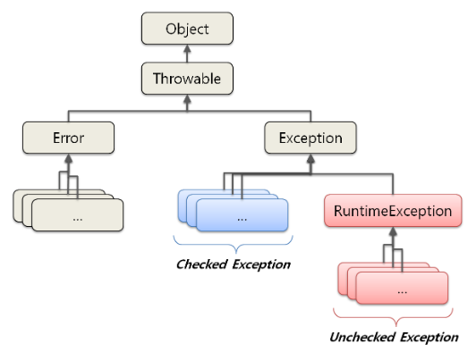

# 예외란? - Error VS Exception

  - 오류( Error ) 와 예외( Exception ) 의 구분
  
  __오류(Error)__ 는 시스템에 비정상적인 상황이 생겼을 때 발생한다. 이는 시스템 레벨에서 발생하기 때문에 심각한 수준의 오류이다. 따라서 개발자가 미리 예측하여 처리할수 없기 때문에, 어플리케이션에서 오류에 대한 처리를 신경 쓰지 않아도 된다.

  **예외(Exception)** 는 개발자가 구현한 로직에서 발생한다. 즉, 예외는 발생할 상황을 개발자가 미리 예측하여 처리할 수 잇는 것으로 예외를 구분하고 그에 따른 처리 방법을 명확히 알고 적용하는 것이 중요하다.
  
## 예외 클래스

  위 그림은 예외클래스의 구조로, 모든 예외 클래스는 Throwable 클래스를 상속 받고 있으며, Throwable은 최상위 클래스 Object의 자식 클래스 이다.
  
  Throwable을 상속받는 클래스는 Error와 Exception이 있다. Error는 시스템 레벨의 심각한 수준의 에러이기 때문에 시스템에 변화를 주어 문제를 처리해야 하는 경우가 일반적이다. 반면에 Exception은 개발자가 로직을 추가하여 처리할 수 있다.
  
  Exception은 수많은 자식클래스를 가지고 있다. 그 중 RuntimeException을 주목해야 한다. RuntimeException은 **CheckedException** 과 **UncheckedException** 을 구분하는 기준이다. Exception의 자식 클래스 중 RuntimeException을 제외한 모든 클래스는 checkedEception이며, RuntimeException과 그의 자식 클래스 들을 UncheckedException이라 부른다.
  
## Checked Exception과 Unchecked(Runtime) Exception

|  | Checked Exception | Unched Exception |
| :------------: | :----------- | :-------------- |
| 처리 여부 | 반드시 예외를 처리해아 함 | 명시적인 처리를 강제하지 않음 |
| 확인 시점 | 컴파일 단계 | 실행 단계 |
| 예외발생시 트랜잭션 처리 | roll-back 하지 않음 | roll-back 함 |
| 대표적 예외 | Exception의 상속받는 하위 클래스 중  Runtime Exception을 제외한 모든 예외  * IOException  * SQLException | RuntimeException 하위 예외  * NullpointerException  * IllegalArgumentException  * IndexOutOfBoundException  * SystemException |
