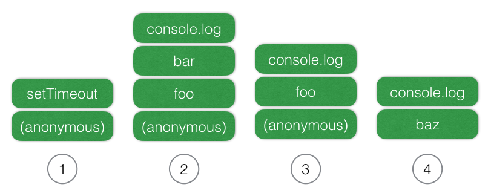

# Event Loop

  자바 스크립트의 큰 특징 중 하나는 '단일 스레드' 기반의 언어라는 점이다. 스레드가 하나라는 말은 곹 동시에 하나의 작업 만을 처리할 수 있다는 말이다. 하지만 실제로 자바스크립트가 사용되는 환경을 생각해보면 많은 작업이 동시에 처리되고 있는 걸 볼 수 있다. 어떻게 스레드가 하나인데 이런 일이 가능할까? 질문을 바꿔보면 __'자바스크립트는 어떻게 동시성(Concurrency)'__ 을 지원 하는걸까 ?  
  
  이때 등장하는 개념이 바로 __'이벤트 루프'__ 이다. Node.js를 소개할때 __'이벤트 루프 기반의 비동기 방식으로 Non-Blocking IO를 지원'__ 과 같은 문구를 본 적이 있을것이다. 즉, 자바스크립트는 이벤트 루프를 이용해서 비동기 방식으로 동시성을 지원한다. 
  
## ECMAScrit에는 이벤트 루프가 없다.
  
  웬만큼 두꺼운 자바스크립트 관련 서적을을 뒤져봐도 이벤트 루프에 대한 설명은 의외로 쉽게 찾아보기가 힘들다. 그 이유는 아마, 실제로 ECMAScript 스펙에 이벤트 루프에 대한 내용이 없기 때문일 것이다. 좀더 구체적으로 표현하면 'ECMAScript에는 동시성과 비동기와 관련된 언급이 없다' 라고 할수 있다. 실제로 V8과 같은 자바스크립트 엔진은 단일 호출 스택(Call Stack)을 사용하며, 요청이 들어올 때마다 해당 요청을 순차적으로 호출 스택에 담아 처리할 뿐이다. 그렇다면 비동기 요청은 어떻게 이루어지며, 동시성에 대한 처리는 누가 하는 걸까? 바로 이 자바스크립트 엔진을 구동하는 환경, 즉 브라우저나 Node.js가 담당한다.
  


  위 브라우저 환경을 담아낸 그림을 보면 우리가 비동기 호출을 위해 사용하는 setTimeout 이나 XMLHttpRequest 와 같은 함수들은 자바스크립트 엔진이 아닌 Wep API 영역에 따로 정의 되어져 있다. 또한 Event Loop와 Task Queue와 같은 장치도 자바스크립트 엔진 외부에 구현되어 있는 것을 볼수 있다.


  
  위 node.js 의 환경을 그린 그림에서도 브라우저의 환경과 비슷한 구조를 볼 수 있다. 잘 알려진대로 Node.js는 비동기 IO를 지원하기위해 LIBUV 라이브러리를 사용하며, 이 LIBUV가 이벤트 루프를 제공한다. 자바스크립트 엔진은 비동기 작업을 위해 Node.js의 API를 호출하며, 이때 넘겨진 콜백은 LIBUV의 이벤트 루프를 통해 스케줄되고 실행된다.
  
  즉 자바스크립트가 '단일 스레드' 기반의 언어라는 말은 '자바스크립트 엔진이 단일 호출 스택을 사용한다'는 관점에서만 사실이고, 실제 자바스크립트가 구동되는 환경(브라우저, Node.js 등)에서는 주로 여러 개의 스레드가 사용되며, 이러한 구동 환경이 단일 호출 스택을 사용하는 자바 스크립트 엔진과 상호 연동하기 위해 사용하는 장치가 바로 '이벤트 루프'인 것이다.
  
## 단일 호출 스택과 Run-to-Completion

  자바스크립트의 함수가 실행되는 방식을 보통 "Run to Completion" 이라고 말한다. 이는 하나의 함수가 실행되면 이 함수의 실행이 끝날때 까지는 다른 어떤 작업도 끼어들지 못한다는 의미이다. 앞서 말했듯이 자바스클비트 엔진은 하나의 호출 스택을 사용하며, 현재 스택에 쌓여있는 모든 함수들이 실행을 마치고 스택에서 제거되기 전까지는 다른 어떠한 함수도 실행될 수 없다.
  
```javascript
  function delay(){
    for (var i = 0; i < 100000; i++);
  }
  function foo() {
    delay();
    bar();
    console.log('foo!'); // (3)
  }
  function bar() {
    delay();
    console.log('bar!'); // (2)
  }
  function baz() {
    console.log('baz!'); // (4)
  }
  
  setTimeout(baz, 10); // (1)
  foo();
```
   __위의 예제를 실행하면 콘솔에는 'bar!' > 'foo!' > 'baz!' 의 순서로 찍히게 된다.__  
   __(위의 코드가 전역 환경에서 실행된다고 가정하고, 주석으로 각 호출 스택을 숫자로 적어 놓았다.)__


  
  __(위 코드의 첫 줄이 실행될 때에 호출 스택의 맨 아래에 익명 함수가 하나 추가되며, 마지막 라인 까지 실행되고 나서야 스택에서 제거된다.)__
  
  __①__ `setTimeout` 함수는 브라우저에게 타이머 이벤트를 요청한 후에 바로 스택에서 제거 된다. __②~③__ 그 후에 `foo` 함수가 스택에 추가 되고, `foo` 함수가 내부적으로 실행하는 함수들이 차례로 스택에 추가 되었다가, 제거된다. 마지막으로 `foo` 함수가 실행을 마치면서 출 스택이 비워지게 되고, __④__ 그 이후에 `baz` 함수가 스택에 추가되어 콘솔에 'baz!'가 직히게 된다.  
  (결과적으로 `baz` 는 10ms보다 더 늦게 실행되게 될 것이다. 즉, 자바스크립트의 타이머는 정확한 타이밍을 보장해 주지 않는다.)
  
## Task Queue 와 Event Loop

  `setTimeout` 함수를 통해 넘긴 `baz` 함수는 어떻게 `foo` 함수가 끝나자 마자 실행될수 있을까? 즉 어디서 대기하고 있다가 누구를 통해 실행되는가? 바로 이 역할을 하는 것이 __Task Queue__ 와 __Event Loop__ 이다. 태스크 큐는 말 그대로 콜백 함수들이 대기하는 큐(__FIFO__) 형태의 배열이라 할 수 있고, 이벤트 루프는 호출 스택이 비워질 때마다 큐에서 콜백 함수를 꺼내와서 실행하는 역할을 해준다.
  
```javascript
  while(queue.waitForMessage()){
    queue.processNextMessage();
  }
```

  위 코드의 `waitForMessage()` 메소드는 현재 실행중인 태스크가 없을 때 다음 태스크가 큐에 추가도리 때까지 대기하는 역할을 한다. 이런 식으로 이벤트 루프는 __현재 실행중인 태스크가 없는지__ 와 __태스크 큐에 태스크가 있는지__ 를 반복적으로 확인하는 것이다.  
  
  - 모든 비동기 API들은 작업이 완료되면 콜백 함수를 태스크 큐에 추가한다.
  - 이벤트 루프는 '현재 실행중인 태스크가 없을때'(주로 호출 스택이 비워졌을 때), 태스크 큐의 첫 번째 태스크를 꺼내와 실행한다.
  
```javascript
  function delay(){
    for (var i = 0; i < 100000; i++);
  }
  function foo() {
    delay();
    console.log('foo!');
  }
  function bar() {
    delay();
    console.log('bar!');
  }
  function baz() {
    delay();
    console.log('baz!');
  }
  
  setTimeout(foo, 10);
  setTimeout(bar, 10);
  setTimeout(baz, 10);
```
  
  이 코드를 실행하면 아무런 지연 없이 `setTimeout` 함수가 세 번 호출된 이후에 실행을 마치고 호출 스택이 비워질 것이다. 그리고 10ms가 지나는 순간 `foo`,`bar`,`baz` 함수가 순차적으로 태스크 큐에 추가된다. 이벤트 루프는 `foo`함수가 태스크 큐에 들어오자 마자, 호출 스택이 비어있으므로 바로 `foo`를 실행해서 호출 스택에 추가한다. `foo`함수의 실행이 끝나고 호출 스택이 비워지면 이벤트 루프가 다시 큐에서 다음 콜백인 `bar`를 가져와 실행한다. `bar`의 실행이 긑나면 마찬가지로 큐에 남아있는 `bar`를 큐에서 가져와 실행한다. 그리고 `baz`까지 실행이 모두 완료되면 현재 진행중인 태스크도 없고 태스크 큐도 비어잇기 때문에, 이벤트 루프는 새로운 태스크가 태스크 큐에 추가될 때까지 대기한다.
  
## 비동기 API와 try-catch

  `setTimeout` 뿐만 아니라 브라우저의 다른 비동기 함수들 (`addEventListener`, `XMLHttpRequest` ...) 이나 Node.js의 IO 관련 함수들 등 __모든 비동기 방식의 API들은 이벤트 루프를 통해 콜백 함수를 실행__ 한다. 

```javascript
  $('.btn').click(function(){ // (A)
    try{
      $.getJSON('/api/members', function (res) { // (B)
        // 에러 발생 코드
      });
    } catch (e) {
      console.log('Error : ' + e.message);
    }
  });
```
  위와 같은 코드가 에러를 잡아낼수 없는 이유를 생각해 보자
  
  위의 코드에서 버튼이 클릭되어 `addEventlistener`를 통해 콜백 A가 실행될때 `$.getJSON`함수는 브라우저의 `XMLHttpRequest` API를 통해 서버로 비동기 요청을 보낸 후에 바로 실행을 마치고 호출 스택에서 제거된다. 이후에 서버에서 응답을 받은 브라우저는 콜백 B를 태스크 큐에 추가 하고 B는 이벤트 루프에 의해 실행되어 호출 스택에 추가된다. 하지만 이때 A는 이미 호출 스택에서 비워진 상태이기 때문에 호출 스택에는 B만 존재할 뿐이다. 즉 B는 A가 실행될 때와는 전혀 다른 독립적인 컨텍스트에서 실행이 되며, 그렇기 때문에 A 내부의 try-catch 문에 영향을 받지 않는다.  
  (==> 동일한 이유로 에러가 발생했을 때 브라우저의 개발자 도구에서 호출 스택을 들여다보아도 B만 덩그라니 놓여져 있는 것을 볼수 있다. 이런 이유로 Node.js의 비동기 API들은 중첩된 콜백 호출에 대한 에러 처리를 위해 '첫 번째 인수는 에러 콜백 함수' 라는 컨벤션을 따르고 있다.)  
  이를 해결하기 위해서는 콜백 B의 내부에서 try-catch를 따로 실행해야 한다.(물론, 이렇게 해도 네트워크 에러나 서버 에러는 잡을 수 없다. 이를 위해 에러 콜백을 따로 제공해야 한다.)
  

```javascript
  $('.btn').click(function(){ // (A)
      $.getJSON('/api/members', function (res) { // (B)
        try{
          // 에러 발생 코드
        } catch(e) {
          console.log('Error : ' + e.message);
        }
      });
  });
```
## setTimeout(fn,0)
  프론트엔드환경의 자바스크립트 코드를 보다 보면 `setTimeout(fn, 0)`와 같은 코드를 종종 보게 된다. 관용적으로 쓰이는 코드이지만, 사실 처음 보는 사람에게는 직관적으로 이해하기 힘든 코드일 것이다. 0초 이후에 실행을 한다는 건 실제로 그냥 실행하는 것과 다를 게 없으니 말이다. 하지만 실제로 이 코드는 그냥 `fn`을 실행하는 것과는 상당히 다른 결과를 가져온다. 위의 예제에서도 보았겟지만 `setTimeout` 함수는 콜백 함수를 바로 실행하지 않고 (호출 스택이 아닌) 태스크 큐에 추가한다. 그렇기 때문에 아래의 코드는 콘솔에 B > A 순서로 출력하게 될 것이다.
  
```javascript
  setTimeout(function(){
    console.log('A');
  },0);
  console.log('B');
```

  프론트엔드 환경에서는 렌더링 엔진과 관련해서 이런 코드가 특히 요긴하게 쓰일 때가 있다. 브라우저 환경에서는 자바스크립트 엔진 뿐만 아니라 다ㅏ른 여러 가지 프로세스가 함께 구도오디고 있다. 렌더링 엔진도 그 중의 일부이며, 이 렌더링 엔진의 태스크는 대부분의 브라우저에서 자바스크립트 엔진과 동일한 단일 태스크 큐를 통해 관리된다. 이로 인해 가끔 예상치 못한 문제가 생길 경우가 있는데, 하단의 코드가 그렇다.
  
```javascript
  $('.btn').click(function() {
    showWaitingMessage();
    longTalkingProcess();
    hideWaitingMessage();
    showResult();
  });
```
  `longTakingProcess`가 너무 오래 걸리는 작업이기 때문에 그 전에 `showWaitingMessage`를 호출해서 로딩 메시지('로딩중...'과 같은)를 보여주려고 한다. 하지만 실제로 이 코드를 실행해 보면 화면에 로딩 메시지가 표시되는 일은 없을 것이다. 이유는 `showWaitingMessage` 함수의 실행이 끝나고 렌더링 엔진이 렌더링 요청을 보내도 해당 요청은 태스크 큐에서 이미 실행중인 태스크가 끝나기를 기다리고 있기 때문이다. 실행중인 태스크가 끝나는 시점은 호출 스택이 비워지는 시점인데, 그 때는 이미 showResult 까지 시행이 끝나 있을 것이고, 결국 렌더링이 진행되는 시점에는 `hideWaitingMessage`로 인해 로딩메시지가 숨겨진 상태일 거이다. 이를 해결하기 위해서 다음처럼 `setTimeout`를 사용할 수 있다.
  
```javascript
  $('.btn').click(function() {
    showWaitingMessage();
    setTimeout(function() {
      longTalkingProcess();
      hideWaitingMessage();
      showResult();
    },0);
});
```
  이 경우에는 `longTakingProcess`가 바로 실행되지 않고 태스크 큐에 추가될 것이다. 하지만 `showWaitingMessage`로 인해 태스크 큐에는 렌더링 요청이 먼저 추가되기 때문에 `longTakingProces`는 그 다음 순서로 태스크 큐에 추가될 것이다. 이제 이벤트 루프는 태스크 큐에 있는 렌더링 요청을 먼저 처리하게 되고 로딩 메시지가 먼저 화면에 보여지게 된다.
  
  꼭 렌더링 관련이 아니라도, 실행이 너무 오래 걸리는 코드를 `setTimeout`을 사용하여 적절하게 다른 태스크로 나누어 주면 전체 어플리케이션이 멈추거나 스크립트가 너무 느리다며 경고창이 뜨는 상황을 방지할 수도 있을 것이다.
  
  한가지 짚고 넘어갈 사실은 '0'이라는 숫자가 실제로 '즉시'를 의미하지 않는다는 점이다. 브라우저는 내부적으로 타이머의 최소단위(Tick)를 정하여 관리하기 때문에 실제로는 그 최소단위 만큼 지난 후에 태스크 큐에 추가되게 된다. 그리고 이 최소단위는 브라우저별로 조금씩 다른데, 예를 들어 크롬 브라우저의 경우 최소단위 4ms를 사용하기 때문에 크롬에서 `setTimeout(fn, 0)`은 `setTimeout(fn, 4)`과 동일한 의미를 갖게 될 것이다.
  
  이런 문제를 해결하기 위해 `setImmediate`라는 API가 제안되었지만, 표준의 반열에 오르지는 못하고 IE10이상에만 포함되어 있다. 실제로 이 메소드는 `setTimeout`과 같은 최소단위 지연이 없이 바로 태스크 큐에 해당 콜백을 추가한다. 비슷한 효과를위해 `postMessage`나 `Messagechanel`을 사용하기도 하는데, 관련된 내용은 [`setImmediate`의 폴리필을 구현한 라이브러리 페이지](https://github.com/YuzuJS/setImmediate)에 잘 정리되어 있다. 
  
## Promise 와 EventLoop

  이런 이벤트 루프의 개념은 실제로 [HTML 스펙](https://html.spec.whatwg.org/multipage/webappapis.html#event-loops)에 정의되어져 있다. 문서에서 이벤트 루프, 태스크 큐의 개념에 대해 잘 정의되어 있는데 문서 중간에 마이크로 태스크(microtask)라는 생소한 용어가 보인다. 다음의 코드를 살펴 보자.
  
```javascript
  setTimeout(function(){  // (A)
    console.log('A');
  }, 0);
  Promise.resolve().then(function(){ // (B)
    console.log('B');
  }).then(function() { // (C)
    console.log('C');
  };
```
  위 코드의 콘솔에 찍히는 순서를 생각해 보면 Promise 또한 비동기로 실행되니 A > B > C 아니면 프라미스는 `setTimeout`처럼 최소단위 지연이 없으니 B > C > A ? 체인형태로 연속해서 호출된 `then()`함수의 동작방식은 어떠한지 생각을 해봐야 한다.  
  정답은 B > C > A 로, 이유는 Promise가 마이크로 태스크를 사용하기 때문이다.
  
  __마이크로 태스크(microtask)__ 는 쉽게 말해서 일반 태스크보다 더 높은 우선순위를 갖는 태스크라고 할 수 있다. 즉, 태스크 큐에 대기중인 태스크가 있더라도 마이크로 태스크가 먼저 실행된다. 위의 예제에서 `setTimeout()`함수는 콜백 A를 태스크 큐에 추가하고, Promise의 `then()` 메소드는 콜백 B를 태스크 큐가 아닌 __별도의 마이크로 태스크 큐__ 에 추가한다. 위의 코드의 실행이 끝나면 태스크 이벤트 루프는 (일반)태스크 큐 대신 마이크로 태스크 큐가 비었는지 먼저 확인하고, 큐에 있는 콜백 B를 실행한다. 콜백 B가 실행되고 나면 두번째 `then()` 메소드가 콜백 C를 마이크로 태스크 큐에 추가한다. 이벤트 루프는 다시 마이크로 태스크를 확인하고, 큐에 있는 콜백 C를 실행한다. 이후에 마으크로 태스크 큐가 비었음을 확인한 다음 (일반)태스크 큐에서 콜백 A를 꺼내와 실행한다.
  
  마이크로 태스크와 일반 태스크에 따라 실행되는 타이밍이 달라지기 대문에 둘을 제대로 이해하고 구분해서 사용하는 것은 중요하다.
  
  * 이벤트 루프는 실제로 자바스크립트 언어의 명세보다는 구동 환경과 더 관련된 내용이기 때문에 다른 프로세스들(렌더링, IO 등) 과 밀접하게 연고나되어 있어 잘 정리된 자료를 찾기가 쉽지만은 않다. 또한 Node.js의 LIBUV는 HTML 스펙을 완벽히 따르지는 않기 때문에 브라우저 환경의 이벤트 루프와 상세 규현이 조금씩 다르다. (심지어 브라우저 별로 구현이 조금씩 다름.)  
  하지만 자바스크립트의 비동기적 특성을 잘 활용하기 위해서는 이벤트 루프를 제대로 이해하는 것이 중요하다. 특히 웹 워커나 [Node.js의 클러스터}(https://nodejs.org/api/cluster.html)를 사용하는 멀티 스레드 환경에서는 이벤트 루프에 대한 이해가 없다면 더욱 힘들것이다.
  
  
 * 참조 
  
  - [자바스크립트와 이벤트루프](https://jakearchibald.com/2015/tasks-microtasks-queues-and-schedules/)
  - [마이크로 태스크](https://jakearchibald.com/2015/tasks-microtasks-queues-and-schedules/)
  
  
