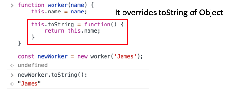
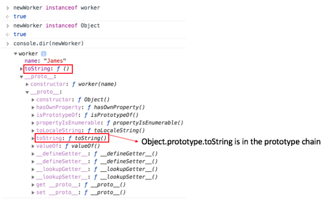

# Object Object

## JavaScript 의 데이터 타입  

  JavaScript에는 기본적으로 7개의 원시 타입과 원시 타입으로 분류되지 않는 object 타입까지 총 8 개의 타입을 지원한다.
  
  - Boolean
  - Null
  - Undefined
  - Number
  - BigInt
  - String
  - Symbol
  - Object
  
  Null 과 Undefined 를 제외하면 위의 타입들은 전부 Object 의 인스턴트 들로 각각에 대한 toString 의 결과 값은 조금씩기 다른 경우도 있지만, 모두 같은 로직 하에 동작한다.  
Object 의 인스턴스라는 말은 그 Object 가 [[prototype]] 프로퍼티를 가지고 있어 프로토타입 체이닝을 통해 Object.prototype 까지 도달할 수 있다는 뜻이 된다. 여기서 [[prototype]] 은 대부분의 브라우저 콘솔에서 확인할 수 잇는 __proto__ 를 의미한다.

자바스크립트에서 모든 객체는 자신만의 메소드를 가질 수 있다. 심지어 이 메소드의 이름이 그 객체의 상위 클래스, 즉 부모클래스라고 부르는 것들의 기존 메소드와 이름이 중복된다고 할지라도 자기 자신의 메소드를 소유할수 있다. 다시 말하자면 객체의 내부 프로퍼티에 함수를 할당할수 있다는 뜻이다.

---

