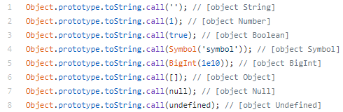

# Object Object

## JavaScript 의 데이터 타입  

  JavaScript에는 기본적으로 7개의 원시 타입과 원시 타입으로 분류되지 않는 object 타입까지 총 8 개의 타입을 지원한다.
  
  - Boolean
  - Null
  - Undefined
  - Number
  - BigInt
  - String
  - Symbol
  - Object
  
  Null 과 Undefined 를 제외하면 위의 타입들은 전부 Object 의 인스턴트 들로 각각에 대한 toString 의 결과 값은 조금씩기 다른 경우도 있지만, 모두 같은 로직 하에 동작한다.  
Object 의 인스턴스라는 말은 그 Object 가 [[prototype]] 프로퍼티를 가지고 있어 프로토타입 체이닝을 통해 Object.prototype 까지 도달할 수 있다는 뜻이 된다. 여기서 [[prototype]] 은 대부분의 브라우저 콘솔에서 확인할 수 잇는 __proto__ 를 의미한다.

자바스크립트에서 모든 객체는 자신만의 메소드를 가질 수 있다. 심지어 이 메소드의 이름이 그 객체의 상위 클래스, 즉 부모클래스라고 부르는 것들의 기존 메소드와 이름이 중복된다고 할지라도 자기 자신의 메소드를 소유할수 있다. 다시 말하자면 객체의 내부 프로퍼티에 함수를 할당할수 있다는 뜻이다.

---

위의 예제에서 __toString__ 을 호출 했을 때 자바스크립트 엔진은 `newWorker` 가 본인의 스코프에서 toString 을 가지고 있는지 확인한다. 만약 가지고 있으면, 그 스코프 내의 toString 이 호출된다. 만약 가지고 있지 않다면, 자바스크립트 엔진은 newWorker의 [[prototype]] 프로퍼티에 연결된 객체로 들어가 그 스코프에서 toString이 있는지 확인한다. 만약 있다면 해당 스코프 내의 toString 이 실행되고, 가지고 있지 않으면 다시 그 스코프 내에 존재하는 ][[prototype]] 프로퍼티에 연결된 객체로 들어가 위 작업을 반복한다. 이 반복 과정은 toString 을 어느 스코프 내에서 찾을 때 까지 반복하거나 더 이상 [[prototype]] 프로퍼티에 연결된 객체가 없을 때까지, 즉 null 일때까지 반복한다. [[protortpe]] 프로퍼티에 연결된 객체가 null인 경우는 최상위 객체인 Object의 [[prototype]] 을 조사했을 때이며, 이렇게 프로토타입에 연결된 객체를 타고 상위 클래스로 올라가면서 새로운 프로토타입의 스코프에서 찾고자하는 값을 조사하는과정을 프로토타입 체이닝이라고 부른다.

* __[Object Object] 는 잘 다듬어진 Object.prototype.toString 의 알고리즘의 결과물이다.__

  먼저 위에서 언급한 모든 데이터 타입에느 Object.prototype.toString 의 인자로 전달될 수 있고 toString 은 클래스 타입을 위의 예제처럼 뱉어낸다. toString을 사용해서 저런식으로 클래스 타입을 얻기 위해선 한 가지 주의할 점으로 Function.prototype.call 이나 function.prototype.apply을 같이 사용해 주어야 한다.  
(call 과 apply 는 호출한 메소드 내에서 참조할 this가 전달한 인자를 참조하게끔 만들어 주는 역할을 한다.)

