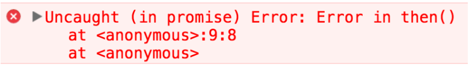
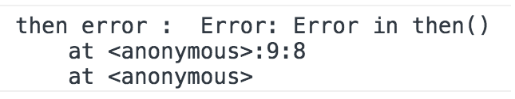

# 비동기 처리

   특정 코드의 연산이 끝날 때까지 코드의 실행을 멈추지 않고 다음 코드를 먼저 실행하는 자바스크립트의 특성을 뜻한다.
   
   - 비동기 처리의 가장 흔한 사례로 JQuery의 ajax를 들수 있는데 화면에 표시할 이미지나 데이터를 서버에서 불러와 ajax통신을 통해 화면에 뿌려줄수 있다.
   
```javascript
  function getData() {
    var tableData;
    $.get('https://domain.com/products/1', function(response) {
      tableData = response;
    });
    return tableData;
  };
  console.log(getData()); //undefined
```
  
  `$.get()` 를 통해 ajax 통신이 이루어 지는데 `https://domain.com` URL에 HTTP GET 으로 데이터를 요청하는것과 같다.
  
  그렇게 서버에서 받아온 데이터는 `response` 인자에 담기고 `tableData`라는 변수에 저장하게 되지만 `console.log(getData());`의 로그상에는 undefined가 찍히게 된다.  
  그 이유는 `$.get()`로 데이터를 요청하고 받아올 때까지 기다려주지 않고 다음 코드인 `return tableData;`를 실행하였기 때문이다. 따라서, `getData()`의 결과 값은 초기 값을 설정하지 않은 tableData의 값 undefined를 출력하게 된다.  
  
 * 이렇게 특정 로직의 실행이 끝날 때까지 기다려주지 않고 나머지 코드를 먼저 실행하는 것을 비동기 처리라고 한다.
 
 * 또 다른 비동기 처리 사례는 `setTimeout()`이다. __setTimeout()는 Web API의 한 종류__ 로, 코드를 바로 실행하지 않고 지정한 시간만큼 기다렸다가 로직을 실행한다.

```javascript
   // #1
   console.log('Hello');
   // #2
   setTimeout(function() {
      console.log('Bye');
   },3000);
   // #3
   console.log('Hello Again');
```
   __Hello(1) > Hello Again(3) > Bye(2) 출력__
   
## 콜백 함수로 비동기 처리 방식의 문제점 해결하기

   - ajax 통신코드 콜백 함수로 개선하기
```javascript
   function getData(callbackFunc) { // 파라미터를 통해 콜백 함수 받아오기
      $.get('https://domain.com/products/1', function(response) {
         callbackFunc(response); // 서버에서 받은 response를 콜백함수 callbackFunc() 함수에 넘겨줌
      });
   };
   
   getData(function(tableData) {
      console.log(tableData); // $.get()의 response 값이 tableData에 전달 됨.
   });
```
   __콜백 함수를 통해 ajax 통신이 끝났을때 (특정 로직이 종료 되었을 때) 원하는 동작을 실행 시킬수 있다.__
   
## 콜백 지옥 (Callback Hell)

   콜백 지옥은 비동기 처리 로직을 위해 콜백 함수를 연속해서 사용할 쌔 발생하는 문제이다.  
```javascript
   $.get('url', function(response) {
      parseValue(response, function(id) {
         auth(id, function(result) {
            display(result, function(text) {
               console.log(text);
            });
         });
      });
   });
```
   서버에서 받아온 데이터를 통해 화면에 표시하기 까지 인코딩, 사용자 인증 등을 처리해야 하는 경우가 있는데 이를 모두 비동기로 처리해야 하는경우 위의 코드처럼 콜백 안에 콜백을 무는 형식의 코딩이 이루어 지게 되는데 이는 가독성도 떨어지고 로직을 변경하기도 어렵다.
   
   일반적으로 콜백지옥을 해결하는 방법으로는 Promise나 Async를 사용하는 방법이 있으나  
   __코딩 패턴만으로만 콜백 지옥을 해결하려면 아래와 같이 각 콜백 함수를 분리해 주어야 한다.__
   
```javascript
   function parseValueDone(id) {
      auth(id, authDone);
   }
   function authDone(result) {
      display(result, displayDone);
   }
   function displayDone(text) {
      console.log(text);
   }
   $.get('url', function(response) {
      parseValue(response, parseValueDone);
   });
```
   중첩해서 선언했던 콜백 익명 함수를 각각의 함수로 구분하였는데 풀이해 보자면 먼저 ajax 통신으로 받은 데이터를 parseValue() 메소드로 파싱을 한 후, parseValueDone()에 파싱한 결과값인 id가 전달 되고, auth()메소드가 실행된다. auth() 메소드로 인증을 거치고 나면 콜백 함수 authDone()가 실행 되고 인증 결과 값인 result로 display()를 호추랗면 마지막으로 displayDone() 메소드가 수행되면서 text가 콘솔에 출력되게 된다.
   
# Promise

   __"A promise is an object that may produce a single value some time in the future"__
   
   Promise는 자바스크립트 비동기 처리에 사용되는 객체이다.
   프로미스는 주로 서버에서 받아온 데이터를 화면에 표시할 때 사용하며 일반적으로 웹 어플리케이션을 구현할 때 서버에서 데이터를 요청하고 받아오기 위해 사용한다.
   
## Promise 코드

```javascript
   function getData(callback) {
     // new Promise() 추가
     return new Promise(function (resolve, reject) {
       $.get('url 주소/products/1', function (response) {
         // 데이터를 받으면 resolve() 호출
         resolve(response);
       });
     });
   }

   // getData()의 실행이 끝나면 호출되는 then()
   getData().then(function (tableData) {
     // resolve()의 결과 값이 여기로 전달됨
     console.log(tableData); // $.get()의 reponse 값이 tableData에 전달됨
   });
```
   콜백 함수로 처리하던 구조에서 `new Promise()`, `resolve()`, `then()`와 같은 Promise API를 사용한 구조로 바뀌었다.  
   
## Promise의 3가지 상태

   Promise를 사용하는 데 있어 가장 기본적인 개념은 바로 프로미스의 상태(state)이다. 여기서 말하는 상태란 프로미스의 처리 과정으로 `new Promise()`로 프로미스를 생성하고 종료될 때까지 3가지의 상태를 가진다.
   
   - Pending(대기) : 비동기 처리 로직이 아직 완료되지 않은 상태  
   - Fulfilled(이행) : 비동기 처리가 완료되어 프로미스가 결과 값을 반환해준 상태
   - Rejected(실패) : 비동기 처리가 실패하거나 오류가 발생한 상태
   
### Pending(대기)
   
   먼저 아래와 같이 `new Promise()` 메소드를 호출하면 Pending(대기) 상태가 된다.
```javascript
   new Promise();
```
   이렇게 `new Promise()`메소드를 호출할 때 콜백 함수의 인자로 `resolve`, `reject`에 접근할 수 있다.
```javascript
   new Promise(function (resolve, reject) {
      //...
    });
```

### Fulfilled(이행)
   __(==> Promise의 '이행'상태를 다르게 표현하면 '완료' 이다.)__
   
   여기서 콜백 함수의 인자 `resolve`를 아래와 같이 실행하면 Fulfilled(이행) 상태가 된다.
```javascript
   new Promise(function (resolve, reject){
      resolve();
   });
```
   그리고 이행 상태가 되면 아래와 같이 `then()`을 이용하여 처리 결과 값을 받을 수 있다.
```javascript
   function getData() {
      return new Promise(function (resolve, reject) {
         var data = 100;
         resolve(data);
      });
   }
   
   // resolve()의 결과 값 data를 resolved Data로 받음
   getData().then(function (resolvedData) {
      console.log(resolvedData); // 100
   });
```
   
### Rejected(실패)

   `new Promise()`로 프로미스 객체를 생성하면 콜백 함수 인자로 `resolve`와 `reject`를 사용할 수 있다. 여기서 `reject`인자로 `reject()`메소드를 시행하면 Rejected(실패) 상태가 된다.
   
```javascript
   new Promise(function (resolve, reject) {
      reject();
   });
```
   그리고, 실패 상태가 되면 실패한 이유 (실패 처리의 결과 값)를 catch()로 받을 수 있다.
```javascript
   function getData() {
     return new Promise(function (resolve, reject) {
       reject(new Error("Request is failed"));
     });
   }

   // reject()의 결과 값 Error를 err에 받음
   getData().then().catch(function (err) {
     console.log(err); // Error: Request is failed
   });
```
   

   
```javascript
   function getData() {
     return new Promise(function (resolve, reject) {
       $.get('url 주소/products/1', function (response) {
         if (response) {
           resolve(response);
         }
         reject(new Error("Request is failed"));
       });
     });
   }

   // Fulfilled 또는 Rejected의 결과 값 출력
   getData().then(function (data) {
     console.log(data); // response 값 출력
   }).catch(function (err) {
     console.error(err); // Error 출력
   });
```
__위 코드는 서버에서 제대로 응답을 받아오면 `resolve()` 메소드를 호출하고, 응답이 없으면 `reject()` 메소드를 호출한다. 호출된 메소드에 따라 `then()` 이나 `catch()`로 분기하여 데이터 또는 오류를 출력 한다.__
   
## 여러 개의 프로미스 연결하기 (Promise Chainng)

   프로미스의 또 다른 특징은 여러개의 프로미스를 연결하여 사용할 수 있다는 점이다. 
   
```javascript
   function getData() {
     return new Promise({
       // ...
     });
   }

   // then() 으로 여러 개의 프로미스를 연결한 형식
   getData()
     .then(function (data) {
       // ...
     })
     .then(function () {
       // ...
     })
     .then(function () {
       // ...
     });
```

__setTimeout() API Promise Chaining 예제__
```javascript
   new Promise(function(resolve, reject){
     setTimeout(function() {
       resolve(1);
     }, 2000);
   })
   .then(function(result) {
     console.log(result); // 1
     return result + 10;
   })
   .then(function(result) {
     console.log(result); // 11
     return result + 20;
   })
   .then(function(result) {
     console.log(result); // 31
   });
```
   위 코드는 프로미스 객체를 하나 생성하고 `setTimeout()`을 이용해 2초 후에 `resolve()`를 호출하는 예제이다.  
   `resolve()`가 호출되면 프로미스가 대기 상태(Pending)에서 이행 상태(Fullfilled)로 넘어가기 때문에 첫 번재 `.then()`의 로직으로 넘어간다. 첫 번째 `then()`에서는 이행된 결과 값 1을 받아서 10을 더한 후 그다음 `.then()`으로 넘겨주고 두 번째 `.then()`에서도 마찬가지로 바로 이전 프로미스의 결과 값 11을 받아서 20을 더하고 다음 `.then()`으로 넘겨준다. 마지막 `.then()`에서 최종 결과 값 31을 출력하게 된다.
   
## 실무상의 Promise Chaining 예제

```javascript
   getData(userInfo)
      .then(parsevalue)
      .then(auth)
      .then(display);
```
   위 코드는 페이지에서 입력된 사용자 정보를 받아와 파싱, 인증 등의 작업을 거치는 코드를 나타낸다. 여기서 `userInfo`는 사용자 정보가 담긴 객체를 의미하고, `parseValue`, `auth`, `display`는 각각 프로미스를 반환하는 함수라고 가정한다.
   
```javascript
   var userInfo = {
     id: 'test@abc.com',
     pw: '****'
   };

   function parseValue() {
     return new Promise({
       // ...
     });
   }
   function auth() {
     return new Promise({
       // ...
     });
   }
   function display() {
     return new Promise({
       // ...
     });
   }
```
   __이와 같은 방식으로 여러 개의 프로미스를 `.then()`으로 연결하여 처리가 가능하다.__
   
## Promise의 에러 처리 방법

   에러 처리 방법에는 2가지 방법이 있다.
   
   1. then()의 두 번재 인자로 에러를 처리하는 방법
   
```javascript
   getData().then(
      handleSuccess,
      handleError
   );
```
   
   1. catch()를 이용하는 방법
   
```javascript
   getData().then().catch();
```

   - 위 두가지 방법 모두 프로미스의 `reject()` 메소드가 호출되어 실패 상태가 된 경우에 실행한다. 즉 프로미스의 로직이 정상적으로 돌아가지 않는 경우 호출된다.
   
```javascript
   function getData() {
      return new Promise(function (resolve, reject) {
         reject('failed');
      });
   }
   
   // 1. then()으로 에러를 처리하는 코드
   getData().then(function () {
      //...
   }, function (err) {
      console.log(err);
   });
   
   // 2. catch()로 에러를 처리하는 코드
   getData().then().catch(function (err) {
      console.log(err);
   });
```

   - Promise 에러 처리는 가급적 __catch()__ 로
   
   개개인의 코딩 스타일에 따라서 `then()`의 두 번째 인자로 처리할 수도 있고 `catch()`로 처리할 수도 있겠지만 가급적으로 `catch()`로 에러를 처리하는 게 더 효율적이다.
   
```javascript
   // then()의 두 번째 인자로는 감지하지 못하는 오류
   function getData(){
      return new Promise(function (resolve, reject) {
         resolve('hi');
      });
   }
   
   getData().then(function (result) {
      console.log(result);
      throw new Error("Error in then()"); // Uncaught (in promise) Error : Error in then()
   }, function (err) {
      console.log('then error : ',err);
   });
```
   `getData()` 함수의 프로미스에서 `resolve()` 메소드를 호출하여 정상적으로 로직을 처리했지만, __`then()`의 첫 번째 콜백 함수 내부에서 오류가 나는 경우 오류를 제대로 잡아내지 못한다.__ 따라서 코드를 실행하면 아래와 같은 오류가 나게 된다.
  
   __에러를 잡지 못했습니다.(Uncaught Error) 로그__
   
   하지만 똑같은 오류를 `catch()`로 처리하면 다른 결과가 나온다.
   
```javascript
   // catch()로 오류를 감지하는 코드
   function getData() {
      return new Promise(function (resolve, reject) {
         resolve('hi');
      });
   }
   
   getData().then(function (result) {
      console.log(result); // hi
      throw new Error("Error in then()");
   }).catch(function (err) {
      console.log('then error : ', err); // then error : Error: Error in then()
   });
```


   -  따라서, 더 많은 예외 처리 상황을 위해 프로미스의 끝에 가급적 `catch()`를 붙이는게 좋다.
   
# async & await

   __기존의 비동기 처리방식인 콜백 함수와 Promise의 단점을 보완하고, 개발자가 읽기 좋은 코드를 작성할수 있도록 도와준다.__
   
## 동기 VS 비동기

   - `fetchUser()` 코드가 서버에서 데이터를 받아오는 HTTP 통신 코드라고 가정하고 예제를 작성해 본다.
   
   __비동기 처리가 적용되지 않은 코드__
---
```javascript
   function logName() {
      var user = fetchUser('domain.com/users/1');
      if (user.id === 1) {
         console.log(user.name);
      }
   }
```

   __콜백을 통한 비동기 처리 코드__
---
```javascript
   function logName() {
   // 아래의 user 변수는 위의 코드와 비교하기 위해 일부러 남겨 놓았다.
      var user = fetchUser('domain.com/users/1', function(user) {
         if(user.id ===1) {
            console.log(user.name);
         }
      });
   }
```

   __async & await 통한 비동기 처리 코드__
---
```javascript
   // async & await 적용 후
   async function logName() {
      var user = await fetchUser('domain.com/users/1');
      if (user.id === 1) {
         console.log(user.name);
      }
   }
```

## async & await 기본 문법
   
```javascript
   async function 함수명 () {
      await 비동기_처리_메소드_명();
   }
```
   함수 앞에 `async`라는 예약어를 붙인 후 함수의 내부 로직 중 HTTP 통신을 하는 비동기 처리 코드 앞에 `await`를 붙인다. 이때 주의할 점은 비동기 처리 메소드가 꼭 프로미스 객체를 반환해야 `await`가 의도한 대로 동작한다.

## async & await 예제

```javascript
   function fetchItems() {
     return new Promise(function(resolve, reject) {
       var items = [1,2,3];
       resolve(items)
     });
   }

   async function logItems() {
     var resultItems = await fetchItems();
     console.log(resultItems); // [1,2,3]
   }
```
   `fetchItems()` 함수는 프로미스 객체를 반환하는 함수로 __프로미스는 "자바스크립트 비동기 처리를 위한 객체"이다.__  
   `fetchItems()`함수를 실행하면 프로미스가 이행(Resolved)되며 결과 값은 `items`배열이 된다.
   
   `logitems()`함수를 실행하면 `fetItems()`함수의 결과값인 `items` 배열이 `resultItems` 변수에 담긴다. 따라서 콘솔에는 [1,2,3]이 찍히게 된다.

   `await`를 사용하지 않았다면 데이터를 받아온 시점에 콘솔을 출력할 수 있게 콜백 함수나 `.then()`등을 사용해야 하지만 `async` `await`문법 덕분에 비동기에 대한 사고를 하지 않아도 된다.
   
* 참조

   CAPTAINPANGYO - 비동기처리
   https://joshua1988.github.io/web-development/javascript/javascript-asynchronous-operation/
