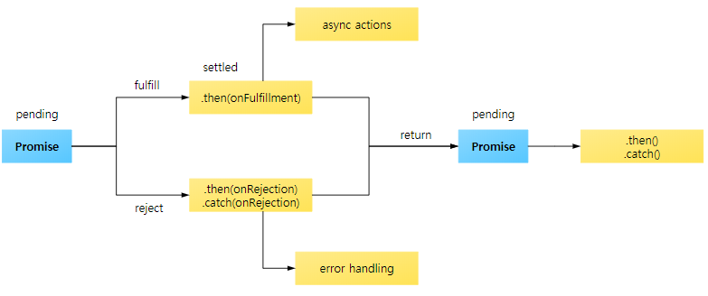

# 비동기 처리

   특정 코드의 연산이 끝날 때까지 코드의 실행을 멈추지 않고 다음 코드를 먼저 실행하는 자바스크립트의 특성을 뜻한다.
   
   - 비동기 처리의 가장 흔한 사례로 JQuery의 ajax를 들수 있는데 화면에 표시할 이미지나 데이터를 서버에서 불러와 ajax통신을 통해 화면에 뿌려줄수 있다.
   
```javascript
  function getData() {
    var tableData;
    $.get('https://domain.com/products/1', function(response) {
      tableData = response;
    });
    return tableData;
  };
  console.log(getData()); //undefined
```
  
  `$.get()` 를 통해 ajax 통신이 이루어 지는데 `https://domain.com` URL에 HTTP GET 으로 데이터를 요청하는것과 같다.
  
  그렇게 서버에서 받아온 데이터는 `response` 인자에 담기고 `tableData`라는 변수에 저장하게 되지만 `console.log(getData());`의 로그상에는 undefined가 찍히게 된다.  
  그 이유는 `$.get()`로 데이터를 요청하고 받아올 때까지 기다려주지 않고 다음 코드인 `return tableData;`를 실행하였기 때문이다. 따라서, `getData()`의 결과 값은 초기 값을 설정하지 않은 tableData의 값 undefined를 출력하게 된다.  
  
 * 이렇게 특정 로직의 실행이 끝날 때까지 기다려주지 않고 나머지 코드를 먼저 실행하는 것을 비동기 처리라고 한다.
 
 * 또 다른 비동기 처리 사례는 `setTimeout()`이다. __setTimeout()는 Web API의 한 종류__ 로, 코드를 바로 실행하지 않고 지정한 시간만큼 기다렸다가 로직을 실행한다.

```javascript
   // #1
   console.log('Hello');
   // #2
   setTimeout(function() {
      console.log('Bye');
   },3000);
   // #3
   console.log('Hello Again');
```
   __Hello(1) > Hello Again(3) > Bye(2) 출력__
   
## 콜백 함수로 비동기 처리 방식의 문제점 해결하기

   - ajax 통신코드 콜백 함수로 개선하기
```javascript
   function getData(callbackFunc) { // 파라미터를 통해 콜백 함수 받아오기
      $.get('https://domain.com/products/1', function(response) {
         callbackFunc(response); // 서버에서 받은 response를 콜백함수 callbackFunc() 함수에 넘겨줌
      });
   };
   
   getData(function(tableData) {
      console.log(tableData); // $.get()의 response 값이 tableData에 전달 됨.
   });
```
   __콜백 함수를 통해 ajax 통신이 끝났을때 (특정 로직이 종료 되었을 때) 원하는 동작을 실행 시킬수 있다.__
   
## 콜백 지옥 (Callback Hell)

   콜백 지옥은 비동기 처리 로직을 위해 콜백 함수를 연속해서 사용할 쌔 발생하는 문제이다.  
```javascript
   $.get('url', function(response) {
      parseValue(response, function(id) {
         auth(id, function(result) {
            display(result, function(text) {
               console.log(text);
            });
         });
      });
   });
```
   서버에서 받아온 데이터를 통해 화면에 표시하기 까지 인코딩, 사용자 인증 등을 처리해야 하는 경우가 있는데 이를 모두 비동기로 처리해야 하는경우 위의 코드처럼 콜백 안에 콜백을 무는 형식의 코딩이 이루어 지게 되는데 이는 가독성도 떨어지고 로직을 변경하기도 어렵다.
   
   일반적으로 콜백지옥을 해결하는 방법으로는 Promise나 Async를 사용하는 방법이 있으나  
   __코딩 패턴만으로만 콜백 지옥을 해결하려면 아래와 같이 각 콜백 함수를 분리해 주어야 한다.__
   
```javascript
   function parseValueDone(id) {
      auth(id, authDone);
   }
   function authDone(result) {
      display(result, displayDone);
   }
   function displayDone(text) {
      console.log(text);
   }
   $.get('url', function(response) {
      parseValue(response, parseValueDone);
   });
```
   중첩해서 선언했던 콜백 익명 함수를 각각의 함수로 구분하였는데 풀이해 보자면 먼저 ajax 통신으로 받은 데이터를 parseValue() 메소드로 파싱을 한 후, parseValueDone()에 파싱한 결과값인 id가 전달 되고, auth()메소드가 실행된다. auth() 메소드로 인증을 거치고 나면 콜백 함수 authDone()가 실행 되고 인증 결과 값인 result로 display()를 호추랗면 마지막으로 displayDone() 메소드가 수행되면서 text가 콘솔에 출력되게 된다.
   
# Promise

   __"A promise is an object that may produce a single value some time in the future"__
   
   Promise는 자바스크립트 비동기 처리에 사용되는 객체이다.
   프로미스는 주로 서버에서 받아온 데이터를 화면에 표시할 때 사용하며 일반적으로 웹 어플리케이션을 구현할 때 서버에서 데이터를 요청하고 받아오기 위해 사용한다.
   
## Promise 코드

```javascript
   function getData(callback) {
     // new Promise() 추가
     return new Promise(function (resolve, reject) {
       $.get('url 주소/products/1', function (response) {
         // 데이터를 받으면 resolve() 호출
         resolve(response);
       });
     });
   }

   // getData()의 실행이 끝나면 호출되는 then()
   getData().then(function (tableData) {
     // resolve()의 결과 값이 여기로 전달됨
     console.log(tableData); // $.get()의 reponse 값이 tableData에 전달됨
   });
```
   콜백 함수로 처리하던 구조에서 `new Promise()`, `resolve()`, `then()`와 같은 Promise API를 사용한 구조로 바뀌었다.  
   
## Promise의 3가지 상태

   Promise를 사용하는 데 있어 가장 기본적인 개념은 바로 프로미스의 상태(state)이다. 여기서 말하는 상태란 프로미스의 처리 과정으로 `new Promise()`로 프로미스를 생성하고 종료될 때까지 3가지의 상태를 가진다.
   
   - Pending(대기) : 비동기 처리 로직이 아직 완료되지 않은 상태  
   - Fulfilled(이행) : 비동기 처리가 완료되어 프로미스가 결과 값을 반환해준 상태
   - Rejected(실패) : 비동기 처리가 실패하거나 오류가 발생한 상태
   
### Pending(대기)
   
   먼저 아래와 같이 `new Promise()` 메소드를 호출하면 Pending(대기) 상태가 된다.
```javascript
   new Promise();
```
   이렇게 `new Promise()`메소드를 호출할 때 콜백 함수의 인자로 `resolve`, `reject`에 접근할 수 있다.
```javascript
   new Promise(function (resolve, reject) {
      //...
    });
```

### Fulfilled(이행)
   __(==> Promise의 '이행'상태를 다르게 표현하면 '완료' 이다.)__
   
   여기서 콜백 함수의 인자 `resolve`를 아래와 같이 실행하면 Fulfilled(이행) 상태가 된다.
```javascript
   new Promise(function (resolve, reject){
      resolve();
   });
```
   그리고 이행 상태가 되면 아래와 같이 `then()`을 이용하여 처리 결과 값을 받을 수 있다.
```javascript
   function getData() {
      return new Promise(function (resolve, reject) {
         var data = 100;
         resolve(data);
      });
   }
   
   // resolve()의 결과 값 data를 resolved Data로 받음
   getData().then(function (resolvedData) {
      console.log(resolvedData); // 100
   });
```
   
### Rejected(실패)

   `new Promise()`로 프로미스 객체를 생성하면 콜백 함수 인자로 `resolve`와 `reject`를 사용할 수 있다. 여기서 `reject`인자로 `reject()`메소드를 시행하면 Rejected(실패) 상태가 된다.
   
```javascript
   new Promise(function (resolve, reject) {
      reject();
   });
```
   그리고, 실패 상태가 되면 실패한 이유 (실패 처리의 결과 값)를 catch()로 받을 수 있다.
```javascript
   function getData() {
     return new Promise(function (resolve, reject) {
       reject(new Error("Request is failed"));
     });
   }

   // reject()의 결과 값 Error를 err에 받음
   getData().then().catch(function (err) {
     console.log(err); // Error: Request is failed
   });
```
   

   
```javascript
   function getData() {
     return new Promise(function (resolve, reject) {
       $.get('url 주소/products/1', function (response) {
         if (response) {
           resolve(response);
         }
         reject(new Error("Request is failed"));
       });
     });
   }

   // Fulfilled 또는 Rejected의 결과 값 출력
   getData().then(function (data) {
     console.log(data); // response 값 출력
   }).catch(function (err) {
     console.error(err); // Error 출력
   });
```
__위 코드는 서버에서 제대로 응답을 받아오면 `resolve()` 메소드를 호출하고, 응답이 없으면 `reject()` 메소드를 호출한다. 호출된 메소드에 따라 `then()` 이나 `catch()`로 분기하여 데이터 또는 오류를 출력 한다.__
   
## 여러 개의 프로미스 연결하기 (Promise Chainng)

   프로미스의 또 다른 특징은 여러개의 프로미스를 연결하여 사용할 수 있다는 점이다. 
   
   
   
* 참조

   CAPTAINPANGYO - 비동기처리
   https://joshua1988.github.io/web-development/javascript/javascript-asynchronous-operation/
