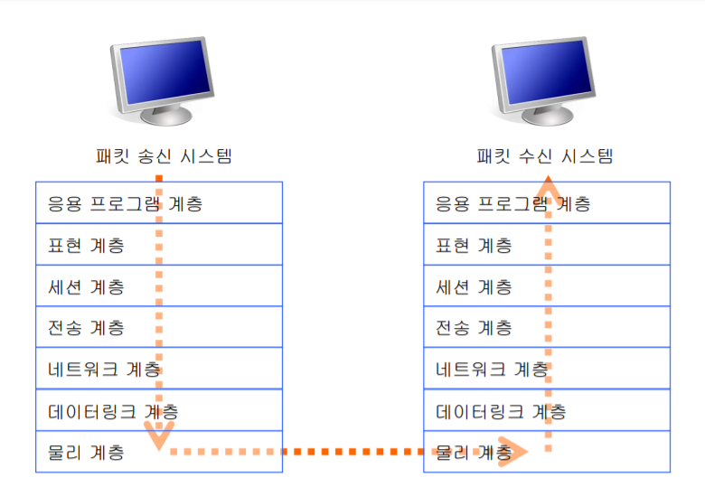
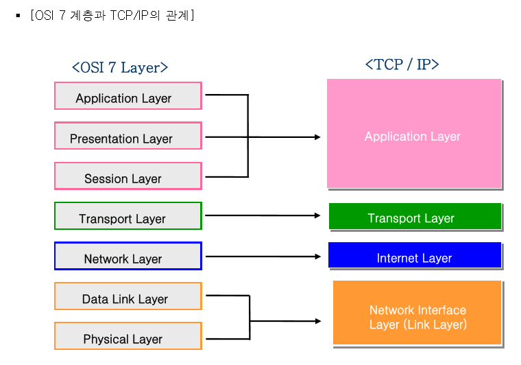
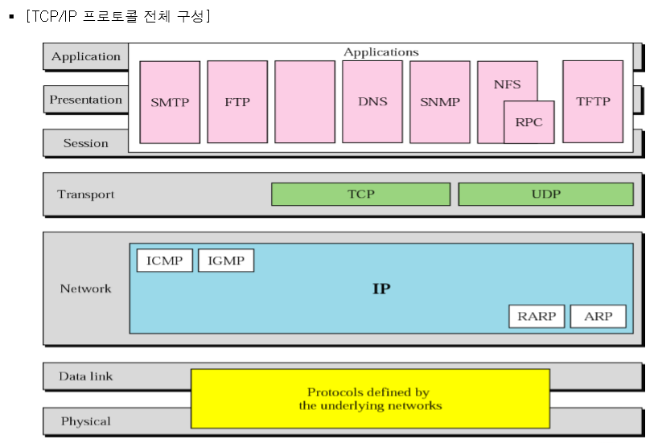
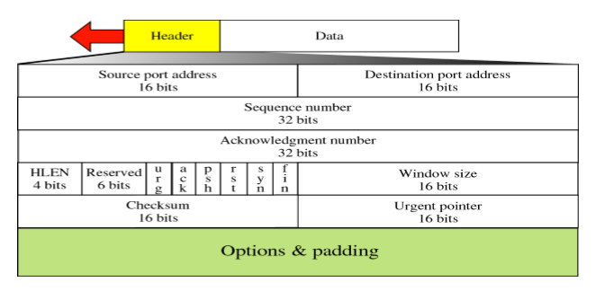
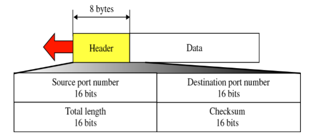
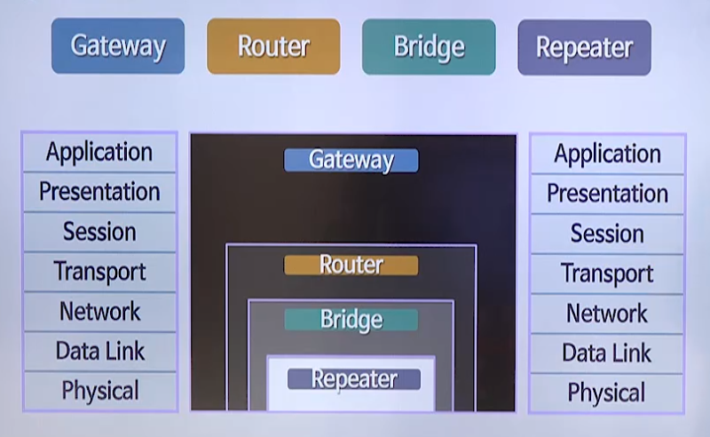

# 2020.05.26 TIL

## OSI 7 계층  
TCP/IP 프로토콜에서는 OSI의 7계층의 기능 중 필욯나 부분만을 선택 취합하여 사용됨  

7계층 : 응용 프로글매 계층 (Application Layer)  
6계층 : 표현 계층 (Presentation Layer)  
5계층 : 세션 계층 (Session Layer)  
4계층 : 전송 계층 (Transport Layer)  
3계층 : 네트워크 계층 (Network Layer)  
2계층 : 데이터링크 계층 (Datalink Layer)  
1계층 : 물리 계층 (Physical Layer)  

  

### 제 7계층 - 응용 프로그램 계층 (Application Layer)  
- 여러가지 서비스를 제공하는 계층으로서 사용자나 응용 프로그램 사이에 데이터의 교환이 가능하게 하는 계층  
- 응용프로그램을 지원하는 프로토콜을 포함함  
- HTTP, FTP, 메일 프로그램(SMTP), WWW, 디렉토리 서비스 등을 제공함  

### 제 6계층 - 표현 계층 (Presentation Layer)  
- 사용자가 주는 정보는 통신에 적당한 형태로 변환하고 세션층에서 전달한 정보는 사용자에 맞게 변환함  
- 데이터의 구조를 하나의 통일된 형식으로 표현하도록 코드를 변환함  
- 데이터의 압축과 정보의 안전성을 높이기 위해 암호화 기능을 수행함  
- 암호화 방식과 압축방식을 알리는 헤더 (Header)가 첨부됨  

### 제 5계층 - 세션 계층 (Session Layer)  
- 사용자 위주의 연결서비스를 제공하며 정보가 흐르는 통로를 만들거나 폐쇄하며 암호를 확인하거나 데이터 전송속도를 조절함  
- 기본적으로는 두 시스템 간의 통신 중 동기화를 유지하고 데이터 교환을 관리함  
- SSL(Secure Socket Layer), 네트워크 파일 시스템 (NFS), SQL  

### 제 4계층 - 트랜스포트 계층 (Transport Layer)  
- 정보의 전달을 관리 감독하는 계층  
- 네트워크 층에서 온 정보를 세션층의 어느 어플리케이션에 보낼 것인가 판독하는 역할과 함께 네트워크 층으로 나가는 정보의 경로를 선택하는 역할을 함  
- 전송계층이라고도 함  
- 호스트와 호스트 간 메시지 단위의 정보교환 및 관리 기능 제공  
- 트랜스포트 계층의 목적 : 데이터 단위가 에러 없이 순서에 맞게 중복되거나 유실되는 일 없이 전송되도록 함  
- TCP(Transmission control Protocol), UDP(User Datagram Protocol)  

### 제 3계층 - 네트워크 계층 (Network Layer)  
- 정보가 전달될 상대의 주소를 찾고 나에게 온 정보의 주소를 확인하여 내 것이면 트랜스포트 층으로 전달함  
- IP 주소 체계를 사용함  
- 경로제어와 통신량 제어를 수행함  
- 대표적인 기능 : 경로배정, 혼잡제어, 인터넷 프로토콜  
- ICMP(Internet Control Message Protocol), IGMP(Interney Group Management Protocol)  

### 제 2계층 - 데이터 링크 계층 (Data Link Layer)  
- 네트워크 층에서 확인한 주소의 상대와 물리적 연결을 위한 통로를 열고 유지함  
- 물리적 링크를 통하여 동기화, 에러 제어, 흐름 제어 등을 통해 패킷을 전송함  
- MAC 주소를 개체간 통신에 사용함  
- SLIP, PPP, RARP 등이 이 계층에서 동작함  

### 제 1계층 - 물리 계층 (Physical Layer)  
- 인터넷 이용시의 랜 케이블, 전화선, 동축 케이블 또는 광 케이블 등의 시스템 간의 물리적인 연결 매체  
- 데이터 링크에서 받은 데이터를 비트 단위로 조개어 전기적 신호로 변환하거나, 수신한 전기적 신호를 비트 형태의 데이터로 변환하는 역할을 함  
- 대표적인 기능  
    - 시간에 대한 동기화  
    - 전송선의 잡음제어  
    - 매체 접속

### 데이터링크 계층(OSI 제2계층) 에서 사용하는 MAC 주소는 인터넷 접속장치인 이더넷의 물리적인 주소  

## MAC(Mdeia Access Control) 주소  
- 이더넷 카드의 읽기용 기억 장치 (ROM)에 기록된 것  
- 주소 크기 : 모두 48 비트  
    - 총 12개의 16 진수로 구성되어 있음  
    - OUI (Organizational Unique Identifier) : 앞쪽 6개의 16진수, 즉 24비트는 미국전기전자학회(IEEE) 가 벤더에 할당한 값으로 네트워크 카드를 만든 회사를 나타냄  
    - 뒤쪽 6개의 16진수인 24비트는 각 회사가 임의로 할당한 시리얼(Host Identifier)을 나타냄  

## TCP/IP 프로토콜  
- 1980년대 초 미국 국방부가 제정한 기종이 서로 다른 컴퓨터 시스템을 서로 연결해 데이터를 전송하기 위한 통신 프로토콜  
- 미국방성의 전산망인 ARPANET을 위하여 개발된 프로토콜  
- 1980년대 초 프로토콜 모델이 공개됨  
    - 다른 기종의 네트워크, H/W, S/W 간에 통신할 수 있는 범용 프로토콜로서 이용되기 시작함  
    - 지금의 인터넷 프로토콜의 사실상 표준으로 인정받고 있음  
    
### TCP/IP 프로토콜의 특징  
- 다른 통신 프로토콜에 비해 단순하며 어떤 네트우크에도 쉽게 적용할 수 있는 유연함이 있음  

### 4개의 계층으로 나누어 구성함  
- Network Interface Layer(링크 계층)을 물리 계층과 데이터 링크 계층으로 나눈다면 5계층  

### TCP/IP 프로토콜 각 계층별 주요기능  
- Application Layer : 응용프로세스 간의 정보 교환  
- Transport Layer : 호스트간의 메시지 단위 정보교환 및 관리  
- Interney layer : 통신 전담 프로세서간의 네트워크를 통한 패킷 교환  
- Network Interface Layer : 단위네트워크 내에서의 패킷 및 신호 전송  

  

### TCP/IP 프로토콜 전체 구성  
  

### Network 계층(IP 계층)  
- 대표적인 기능  
    1. 패킷(데이터그램) 및 인터넷 주소체계정의  
    2. 목적지까지 패킷을 전송하기 위한 경로설정  
    3. 데이터그램의 분할과 재조립 등  
    
- IP 프로토콜은 내부적으로 같은 계층에서 사용될 수 있는 많은 프로토콜들을 가지고 있음  

#### ICMP (Internet Control Message Protocol)  
- 호스트 서버와 인터넷 게이트웨이 사이에서 메시지를 제어하고 에러를 알려주는 프로토콜  

#### IGMP (Internet Group Management Protocol)  
- 인터넷 컴퓨터가 멀티캐스트 그룹을 인근의 라우터들에게 알리는 수단을 제공하는 인터넷 프로토콜  

#### ARP (Address Resolution Protocol)  
- 링크계층에서 수행되는 프로토콜  
- IP 네트워크 상에서 IP 주소를 물리적 네트워크 주소 (MAC) 로 대응 시키기 위해 사용됨  

#### RARP (Reverse Address Resolution Protocol)  
- 링크계층에서 수행되는 프로토콜  
- IP 호스트가 자신의 물리 네트워크 주소(MAC)는 알지만 IP 주소를 모르는 경우, 서버로부터 IP 주소를 요청하는 프로토콜  

### Transport 계층 (TCP 와 UDP)  

#### TCP (Transmission Control Protocol)  
- TCP/IP 를 구성하는 여러 프로토콜 중 가장 중요한 기능인 전송 데이터의 신뢰성을 보장  

##### TCP 3-way handshaking  
- 연결 지향(Connection Oriented)의 연결 설정 과정  
- 순서번호(Sequence Number), 확인 번호(Acknowledge Number), 체크섬(Checksum) 등 TCP 헤더의 여러 필드들을 이용  

- 오류제어와 흐름제어의 기능이 있음  
#### TCP Header  

#### UDP (User Datagram Protocol)  
- TCP와는 달리 전송 성능 중심의 프로토콜  
- 오디오나 비디오와 같은 멀티미디어 스트리밍 서비스의 경우에서와 같이 빠른 속도로 사용자의 전송 용구를 만족시키는 측면에 주로 사용되거나 DNS 질의/응답 등에 사용됨  
- 이러한 단순성이 보안 측면에 있어서는 TCP 보다 더욱 위험성을 초래할 수 있음  

#### UDP Header
  

### Application 계층 (각종응용서비스)  
- TCP/IP 프로토콜을 통해 제공되는 메일 서비스 > 응용 계층의 SMTP 프로토콜 사용  
- 웹서비스 > HTTP 프로토콜 사용  
- 파일 전송 서비스 > FTP 프로토콜 사용  

- 응용 프로토콜  
    - TCP/IP 기반의 여러 응용 서비스들이면서 동시에 응용 서비스들을 규약하는 프로토콜 자체
    - 이러한 각 응용 프로토콜이 제공하는 서비스는 TCP/IP 의 포트번호 메커니즘에 따라 구분됨
    
### TCP/IP 프로토콜의 보안성  
- TCP/IP 프로토콜은 개발 당시 보안에 대한 문제를 고려하지 않고 개발되었기 때문에 TCP/IP 프로토콜 계층 자체에서 보안 기능이 없음  
- 보안의 취약성으로는 IP주소 기반의 인증문제로 인한 유일한 식별자의 부족과 접속허용의 문제점이 있다.  
- 사용자의 부가적인 보안성 향상 요구를 위해서는 보통 사용자레벨에서 컨트롤이 가능한 응용 프로토콜에 보안성을 포함하는 것이 일반적인 경향임  
- 보안 요구를 충족시키기 위해 Application 계층에서 개발된 프로토콜  
    - PGP , S/MINE , S-HTTP  
- 최근에는 IPv4에서 IPv6으로 넘어가는 시기임  
    - 보안성 향상을 위한 많은 기능들이 새로운 버전의 TCP/IP Version 6에 포함되고 있음  

### 네트워크 장비  
Gateway , Router , Bridge , Repeater  
  

#### Gateway  
- 프로토콜이 서로 다른 통신망이 접속할 수 있도록 해주는 장치로 프로토콜 변환기의 하나임  
- 전 계층의 프로토콜을 상호 변환 하므로 복잡합  
    - Application, Transport, network, Datalink, Physical 계층에서 작동함  
- 다른 네트워크로 들어가는 입구 역할을 하는 네트워크 포인트  
    - 일반 회사의 네트워크 내에서 트래픽을 통제하는 컴퓨터들이나, 인터넷 서비스 제공자들의 컴퓨터를 지칭함  
    - 한 회사의 네트워크에서는 게이트웨이 노드 역할을 하는 컴퓨터가 프록시 서버나 방화벽 서버의 역할을 함께 수행하는 경우도 있음  
- 일반적으로 라우터 내에 설치된 소프트에어가 gateway 역할을 함  

#### Router  
- Network 계층에서 작동되는 랜(LAN)을 연결해주는 장치  
- 송신정보에서 수신처 주소를 읽고 가장 적절한 통신통로를 지정하고, 다른 통신망으로 전송하는 장치  
- 네트워크 주소를 이요하여 2개의 네트워크층 주소 사이에 가능한 여러 경로 중에서 특정 전송을 위해 가장 좋은 경로를 결정함  
- 비슷한 프로토콜을 사용하는 네트워크들 간에 패킷을 전송, 수신 및 중계  
- 통신 흐름을 제어하며 통신망 내부에 여러 보조 통신망을 구성하는 등의 다양한 통신망 관리기능을 수행함  

#### Bridge  
- Datalink 계층 (MAC Layer)에서 접속을 지원하는 장비  
- 랜을 이더넷이나 토큰링과 같이 서로 같은 프로토콜을 쓰고 있는 다른 랜과 연결시켜주는 장비
- 발신한 메시지에 대해 같은 건물 내에 있는 랜으로 보내야 할지, 혹은 길 건너 다른 빌딩 내의 랜으로 보내야 할지를 판단하는 장치  
- 어떤 주소들이 어떤 네트워크에 있는지를 미리 파악하고, 메시지들을 정확히 다른 네트워크로 전달할 수 있도록 내부 Table을 관리/적용 함   

#### Repeater  
- 전기적 신호를 중계하는 장비  
- 서로 다른 네트워크를 연결하지 못하고 기존의 네트워크 시그널을 증폭하여 단순히 네트워크 물리적인 길이를 연장하는데 사용됨  
- 전자기 또는 광학 전송매체 상에서 신호를 수신하고, 증폭하며, 매체의 다음 구간으로 재전송 시키는 장비  
- 전자기장 확산이나 케이블 손실로 인한 신호 감쇠를 극복하므로, 여러 대의 리피터들을 써서 신호를 먼 거리까지 연장할 수 있음  

## 네트워크 보안  
- 현존하는 모든 통신회선 상의 정보는 항상 호기득 가능하다고 가정  

#### 네트워크 보안의 목적  
- 통신회선 상의 정보를 보호할 수 있는 방법을 찾는 것  

#### 네트워크 시스템에서 제공되는 기본적인 정보보호 서비스  
- 인증 / 무결성 / 접근통제 / 부인 방지 / 비밀보장 / 가용성 등  

#### 네트워크 시스템은 기존의 컴퓨터 시스템보다 복잡함  
- 운영체제에 적용되는 대다수의 보안 개념과 보안통제가 적용됨  

1. 비밀성(기밀성) 유지 및 보장  
    - 비밀성 : 네트워크를 통하여 전송되는 데이터가 확인되지 않고 ㅇ니가되지 않은 상대방에게 노출되지 않도록 하는 기본적인 목표  
    - 네트워크 통신상 교환되는 정보의 비밀 보장과 인가된 사용자 이외에 해당 정보에 대한 접근 차단  
    - 암호화 기법을 사용함  
2. 무결성의 유지 및 보장  
    - 무결성 : 네트워크를 통하여 송수신 되는 정보의 내용이 불법적으로 생성, 변경, 삭제되지 않도록 보호  
    - 정보가 변조된 경우에는 이를 탐지해내고 정당한 사용자에게 경고해 줌  
3. 데이터 발신처 확인  
    - 원격지로부터 전송 받은 데이터가 원하는 곳으로부터 올바르게 전송된 것인지를 확인하는 방법   
4. 통신 사실의 부인방지  
    - 네트워크 상에서 통신에 참여했던 사실을 부인하지 못하도록 하는 방법  
    - 통신 경로 및 행위 추적을 위한 중요한 기능  
5. 사용자 신분 확인 및 인증  
    - 네트워크에 접속을 시도하는 대상이 사전에 허가된 대상인지를 확인하여 불법적인 대상으로부터 네트워크와 정보를 보호  
6. 인가된 접근의 허용  
    - 허가된 사용자에게만 접근을 허용함  
    - 접근이 허가된 사요자일지라도 허가도니 범위 내에서만 정보 자원의 이용과 상호 통신이 가능 하도록 하는 것  
7. 가용성의 향상  
    - 네트워크에 접속된 전체 시스템의 성능을 안정적으로 유지하는 한편 전체 시스템의 이용 효율은 이상이 없도록 하는 것  
    - 안정성과 효율성은 상호 절충관계가 있으나 네트워크에 대한 사용 요구 정도와 실제 활용도 등 여러 가지 요소를 고려하여 균형을 유지함  
    - 네트워크 이용 효율을 극대화 되도록 함  

### OSI에서의 보안 프로토콜 구조  
- 제 1계층
    - 물리 계층(Physical Layer) 보안  
        - ISO 9160 에서 정의하고 있으며 물리 계층에서 전송되는 모든 비트를 전부 암호화하도록 규정  
- 제 2계층  
    - 데이터 링크 계층(Data Link Layer) 보안 
        - 보안 서비스는 규정되어 있으나 다양한 프로토콜에 적용할 수 있는 구체적이고 실제적인 보안 메커니즘은 미정  
        - IEEE 802.10 에서는 근거리 전산망에서의 보안을 위하여 제 2계층의 보안 프로토콜을 정의함  
- 제 3계층  
    - 네트워크 계층 보안  
        - SP3 (Security protocol 3)  
- 제 4계층  
    - 트랜스포트 계층(Transport Layer) 보안  
        - SP4 (Security protocol 4)  
- 제 5계층  
    - 세션 계층(Session Layer)  
        - 보안 서비스가 제공되지 않음  
- 제 6계층  
    - 표현 계층(Presentation Layer) 보안  
        - 암호화(부호화)  
- 제 7계층  
    - 응용 계층(Application Layer) 보안  
        - MHS 보안, FTAM 보안, 디렉토리 보안  
